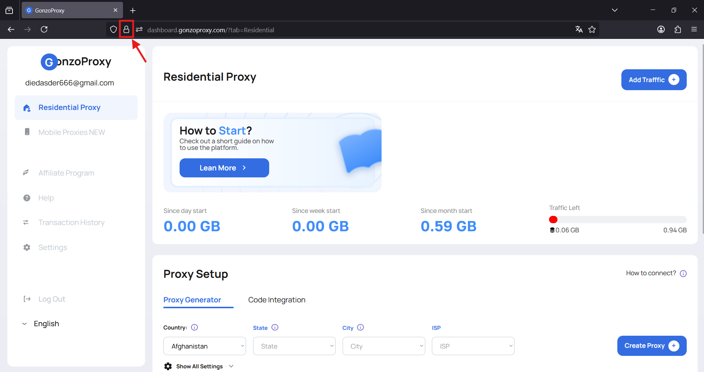
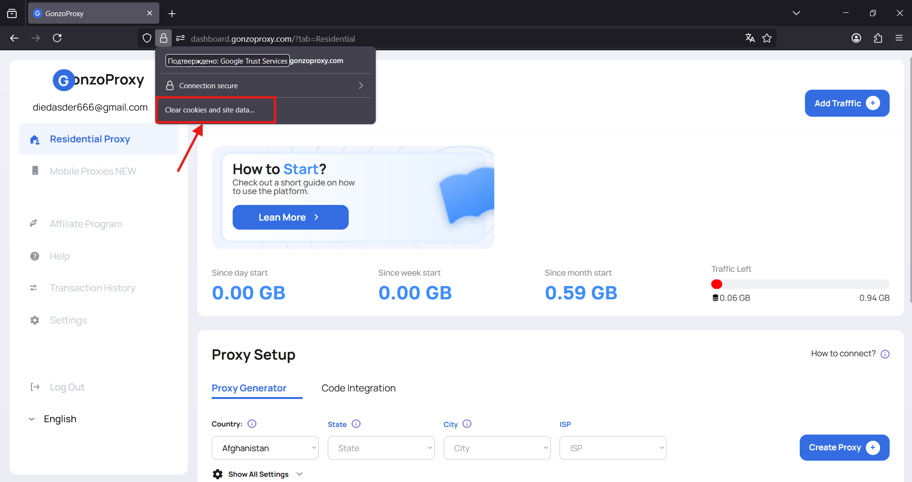
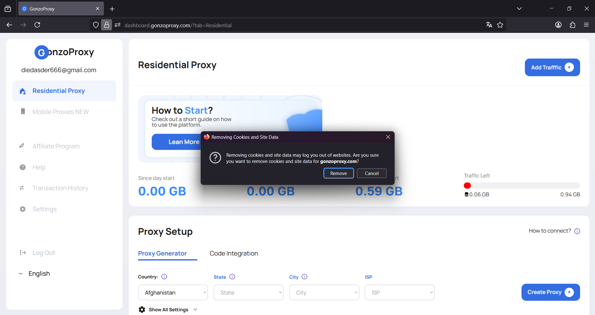
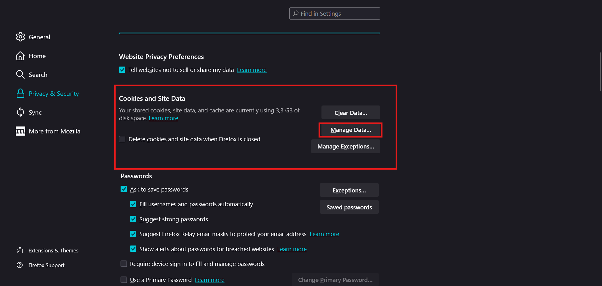

# 🔧 Clearing your browser’s cache and cookies

If you see a **“Session expired”** message or any other error when signing in to the **GonzoProxy** dashboard, you’ll likely need to clear your cache and cookies.

This helps remove outdated or broken data that might be preventing the site from working properly.

Below are step-by-step instructions for different browsers:

***

### 🧹 How to clear cache and cookies for a specific site

***

#### 🔵 Google Chrome

_(Also works for Yandex Browser, Opera, Microsoft Edge, and other Chromium-based browsers)_

1. Open the [**GonzoProxy dashboard**](https://dashboard.gonzoproxy.com/?utm_source=gitbook\&utm_medium=eng\&utm_content=cookie).
2. Click the **lock icon (🔒)** or **info icon** to the left of the website address in the address bar.

<figure><figcaption></figcaption></figure>

In the menu that appears, click **“Cookies and site settings”**.

<figure><figcaption></figcaption></figure>

<figure><figcaption></figcaption></figure>

In the popup window:

* Delete each entry.
* Click **Done** when finished.

<figure><figcaption></figcaption></figure>

3. **Clearing the cache:**

Press **F12** or **Ctrl + Shift + I** to open the developer tools.

Go to the **Application** tab.

<figure><figcaption></figcaption></figure>

In the left sidebar, choose **Storage**.

Check these boxes:

* **Cookies**
* **Cache Storage**
* **Local Storage**

Click **Clear site data**.

<figure><figcaption></figcaption></figure>

✅ Now refresh the page (**Ctrl + R**) and try logging in again.

***

#### 🟠 Mozilla Firefox

1. Open the [**GonzoProxy dashboard**](https://dashboard.gonzoproxy.com/?utm_source=gitbook\&utm_medium=eng\&utm_content=cookie).
2. Click the **lock icon (🔒)** to the left of the address bar.

<figure><figcaption></figcaption></figure>

* Choose **“Clear cookies and site data…”**.

<figure><figcaption></figcaption></figure>

* Confirm by clicking **Remove**.

<figure><figcaption></figcaption></figure>

3. **Additional data cleanup:**

* Click the menu button (three lines in the top right corner) → **Settings** → **Privacy & Security**.

<figure><figcaption></figcaption></figure>

* Scroll down to the **Cookies and Site Data** section.

<figure><figcaption></figcaption></figure>

* Click **Manage Data…**.
* Type **GonzoProxy** in the search box.

<figure><figcaption></figcaption></figure>

* Select the site and delete its data.

✅ Reload the site and check if the issue is resolved.

***

### ⚠️ Important Notes:

* Clearing cookies and cache will log you out of the site (if you were logged in).
* You might need to refresh the page after cleanup:
  * **Windows/Linux**: `Ctrl + R`
  * **macOS**: `Cmd + R`

***

### 👾 Sign in here: [dashboard.gonzoproxy.com](https://dashboard.gonzoproxy.com/?utm_source=gitbook\&utm_medium=eng\&utm_content=cookie)

***

### 📱 Stay Connected

* [Telegram Channel](https://t.me/GonzoProxy)
* [Telegram Chat ](https://t.me/GonzoProxy_Chat)
* [Instagram](https://www.instagram.com/gonzoproxy)
* [24/7 Support](https://t.me/GonzoProxy_bot)

💬 Our team is here for you. Write to us if anything goes wrong.
