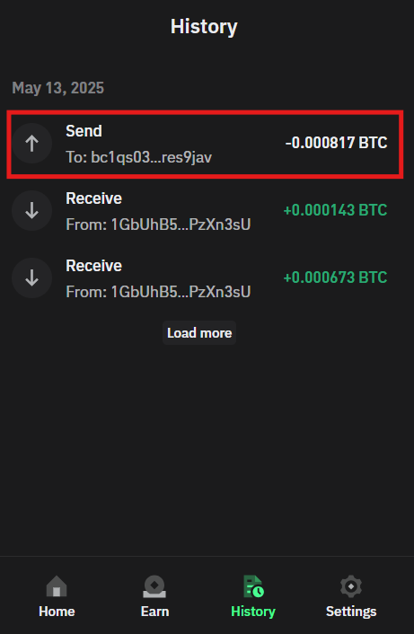
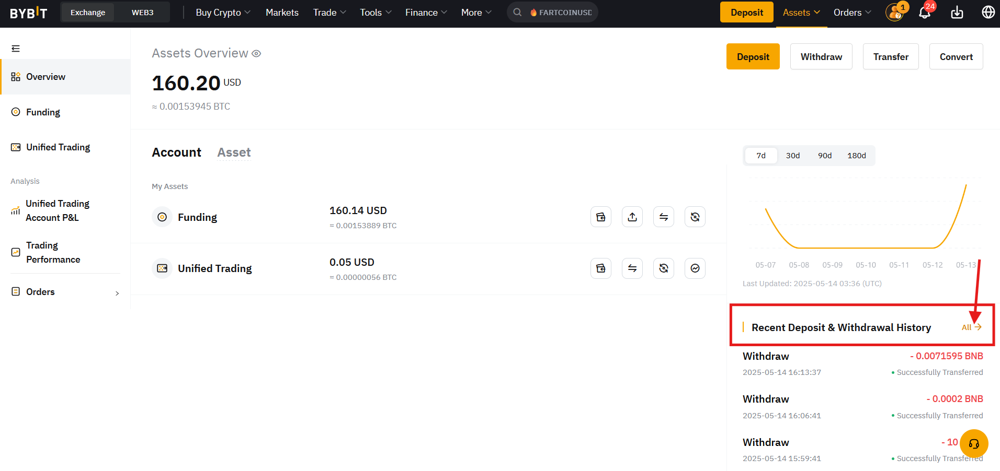

# 🚀 How to find a transaction HASH and what are cryptocurrency networks?

You sent cryptocurrency, and the seller suddenly asks:

> **“Please send the TxID and specify the transfer network!”** 🤔

Don’t worry, let’s break down in detail what this “network” is, why it’s important, and how to quickly find your transaction in any blockchain!

***

### 📌 What is a cryptocurrency network?

A cryptocurrency network (blockchain) is a decentralized database where all transactions of a specific cryptocurrency are recorded.\
Each cryptocurrency has its own network, so it’s important to select the correct one when transferring funds.

***

### 🔍 Why is this important?

If you send cryptocurrency using the wrong network, your funds could be **lost** or **delayed**.\
That’s why it’s crucial to **always double-check the network** before making a transfer!

***

### 📌 Examples of popular networks and cryptocurrencies

Here are the most common networks and the cryptocurrencies they carry:

* 🟠 **Bitcoin**: Bitcoin (BTC)
* 🔷 **Ethereum**: Ethereum (ETH), USDT ERC-20, USDC ERC-20 and other ERC-20 tokens
* 💎 **Binance Smart Chain (BSC)**: BNB, USDT BEP-20, CAKE and other BEP-20 tokens
* ⚡ **Solana**: Solana (SOL), USDC, NFTs and other SPL tokens
* 🌀 **Polygon**: MATIC, USDT, USDC and other tokens
* 💸 **XRP Ledger**: Ripple (XRP)
* 🧠 **Cardano**: Cardano (ADA)
* 🐶 **Dogecoin**: Dogecoin (DOGE)
* 🪙 **TRON**: TRON (TRX), USDT TRC-20
* 🧱 **TON**: Toncoin (TON)

***

### 📌 What is a Blockchain explorer?

🕵️‍♂️ A **blockchain explorer** is a website that allows you to view and track transactions of any cryptocurrency in real-time.

Each cryptocurrency network has its own explorer, so look for your transfer in the explorer of the network you sent it in.

With a **TxID** (Transaction Hash) in a blockchain explorer, you can check:

* 📬 Sender and receiver addresses
* 💰 Amount and transaction fee
* ✅ Transaction status
* 🗓️ Date and time of the transfer

***

### 📌 How to find the sending network and TxID?

Here’s how to do it in popular services:

### 1️⃣ MetaMask 🦊

* Open MetaMask → go to **Activity**.

<figure><figcaption></figcaption></figure>

* Click on the transaction → **“Copy transaction ID”**.

<figure><figcaption></figcaption></figure>

* The current network is shown at the top of MetaMask.

<figure><figcaption></figcaption></figure>

### 2️⃣ Trust Wallet 📱

* Open Trust Wallet → select **History**.

<figure><figcaption></figcaption></figure>

* Tap on the transaction.

<figure><figcaption></figcaption></figure>

* Copy the **transaction hash**.

<figure><figcaption></figcaption></figure>

* The network name is shown at the very bottom.

<figure><figcaption></figcaption></figure>

### 3️⃣ Exchanges (Binance, Bybit, OKX, etc.) 💱

* Go to the **“Transaction History”** or **“Withdrawal”** section.

<figure><figcaption></figcaption></figure>

* Open the transaction and find the **TxID** and the **network** specified for the withdrawal.

<figure><figcaption></figcaption></figure>

***

### 📌 Popular blockchain explorers by network

Each network has its own explorer. Open the one that matches the network you sent the transfer in.

#### 🟠 Bitcoin (BTC)

* [Blockchain.com](https://www.blockchain.com/explorer)
* [Blockstream.info](https://blockstream.info/)
* [BTC.com](https://btc.com/)
* [Blockchair](https://blockchair.com/bitcoin)

#### 🔷 Ethereum (ETH)

* [Etherscan.io](https://etherscan.io/)
* [Ethplorer.io](https://ethplorer.io/)
* [Blockchair.com](https://blockchair.com/ethereum)

#### 💎 Binance Smart Chain (BSC)

* [BscScan.com](https://bscscan.com/)
* [Ankrscan.io](https://ankrscan.io/)

#### ⚡ Solana (SOL)

* [Solscan.io](https://solscan.io/)
* [Explorer.solana.com](https://explorer.solana.com/)

#### 🌀 Polygon (MATIC)

* [Polygonscan.com](https://polygonscan.com/)

#### 💸 XRP Ledger (XRP)

* [XRPScan.com](https://xrpscan.com/)
* [Bithomp.com](https://bithomp.com/)

#### 🧠 Cardano (ADA)

* [CardanoScan.io](https://cardanoscan.io/)
* [AdaScan.net](https://adascan.net/)

#### 🐶 Dogecoin (DOGE)

* [Blockchair.com](https://blockchair.com/dogecoin)
* [BlockCypher.com](https://live.blockcypher.com/doge/)

#### 🪙 TRON (TRX)

* [Tronscan.org](https://tronscan.org/)
* [TronGrid.io](https://trongrid.io/)

#### 🧱 TON (Toncoin)

* [TONscan.org](https://tonscan.org/)
* [TON.live](https://ton.live/)

***

### 📌 Example of checking a transaction in a blockchain explorer

👉 Paste the TxID (for example):\
`0xb4bc263278d3f77a652a8d73a6bfd8ec0ba1a63923bbb4f38147fb8a943da26d`\
into [Etherscan.io](https://etherscan.io/) and get detailed information.

<figure><figcaption></figcaption></figure>

* 📤 **Sender address**
* 📥 **Recipient address**
* 💰 **Amount in ETH**
* ✅ **Confirmation status**
* ⛽ **Transaction fee (gas)**
* 🗓️ **Date and time of the transaction**

***

### 📝 Final tips

✅ Always **verify the network** before sending cryptocurrency.\
✅ Use **reliable blockchain explorers**.\
✅ **Save the TxID** of important transactions in case of any disputes.

Now you're fully ready to identify the correct network and track any transaction using its TxID! 🎉

***

### 📱 Stay Connected

* [Telegram Channel](https://t.me/GonzoProxy)
* [Telegram Chat ](https://t.me/GonzoProxy_Chat)
* [Instagram](https://www.instagram.com/gonzoproxy)
* [24/7 Support](https://t.me/GonzoProxy_bot)

💬 Our team is here for you. Write to us if anything goes wrong.
