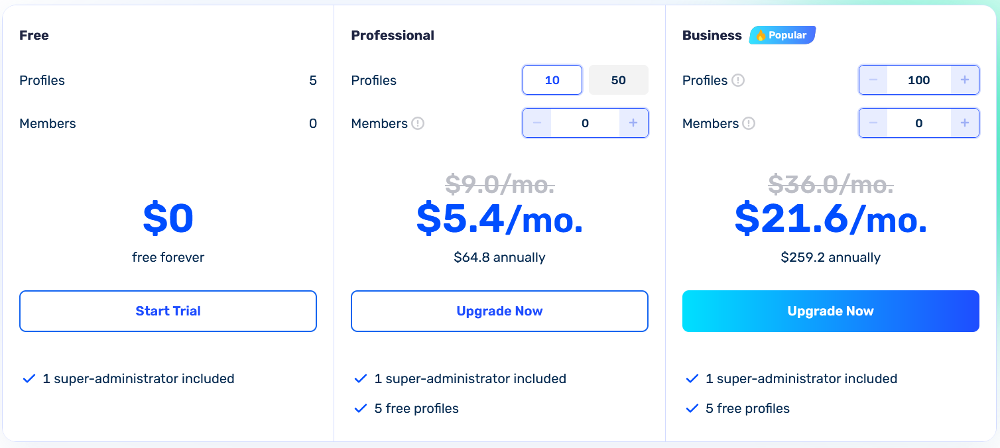

# 🔍 Setup AdsPower

Imagine juggling multiple online accounts—be it for social media, e-commerce, or marketing—without the constant fear of getting them all banned. That's where **AdsPower** steps in. This anti-detect browser is a favorite among affiliate marketers, e-commerce pros, and anyone managing numerous accounts.

***

### 🧠 **Why AdsPower stands out**

In a sea of browsers claiming "anonymity and security," **AdsPower** truly delivers. It's more than just a profile manager; it's a comprehensive platform catering to both beginners and seasoned teams. Here's why AdsPower is a game-changer:

#### 1. **Mastering browser fingerprints** 🧬

Controlling browser fingerprints is fundamental for anti-detect browsers, and AdsPower takes it to the next level. You're not just tweaking headers or user agents; you're crafting an entire digital persona.

<figure><figcaption></figcaption></figure>

**Key features:**

* **Mobile OS Fingerprints:** Supports not just desktop OS but also mobile ones like Android and iOS. This is crucial for platforms like TikTok and Instagram that prioritize mobile users.
* **Dual Engine Support:** Work with both Chromium and Firefox. Most browsers stick to one engine, but AdsPower offers flexibility.
* **Comprehensive Customization:** Adjust everything from GPU, WebGL, WebRTC, system language, fonts, device noise, screen resolution, and more. You can manually create a "digital fingerprint" that mirrors any user.

📌 **Bottom Line:** AdsPower doesn't just hide your identity; it makes you appear as a completely different user to anti-fraud systems—seamlessly and without glitches.

***

#### 2. **Code-free automation** ⚙️

AdsPower comes equipped with RPA (Robotic Process Automation), allowing you to automate browser actions without any coding skills.

<figure><figcaption></figcaption></figure>

**Automation capabilities:**

* **Script-Free Scenarios:** Launch automation sequences without writing a single line of code.
* **User Actions:** Automate clicks, page navigations, text inputs, logins/logouts, and multi-account management.
* **Templates:** Utilize pre-built templates to avoid starting from scratch.

The entire setup is visual and intuitive, making it accessible even for those without a technical background.

📎 **Learn More:** [AdsPower RPA Guide](https://www.adspower.com/blog/step-by-step-instructions-for-using-rpa-automation-from-adspower)

***

#### 3. **Unique synchronizer tool** 🧩

AdsPower's Synchronizer is a standout feature you won't find elsewhere. It lets you perform the same action across multiple browser profiles simultaneously—no scripts, no plugins, no hassle.

<figure><figcaption></figcaption></figure>

**Synchronizable actions:**

* **Navigation:** Open links across profiles.
* **Text Input:** Enter text fields simultaneously.
* **Form Filling:** Complete forms in bulk.
* **Clicks:** Click buttons across profiles.
* **Extensions:** Install browser extensions en masse.

<figure><figcaption></figcaption></figure>

Think of it as mirroring actions across tabs. One click, and it's replicated in 10, 50, or even 100 profiles. Ideal for managing account networks, duplicating tasks, or executing bulk actions—all without additional programming or paid add-ons.

📎 **Discover More:** [AdsPower Synchronizer](https://www.adspower.com/blog/post/Synchronizer)

***

#### 4. **Streamlined team collaboration** 👥

AdsPower excels in team management, offering more than just user additions. It's a full-fledged system for controlling access and actions within the browser.

<figure><figcaption></figcaption></figure>

**Team features:**

* **Permission Levels:** Define who can view or edit specific profiles.
* **Activity Logs:** Track who did what and when, making it easy to identify any issues.
* **Task Assignment:** Delegate responsibilities like account farming, launching, or monitoring.

Perfect for agencies, affiliate teams, and partnerships where collaboration is key.

***

### 💻 **Getting started with AdsPower**

**Installation Steps:**

1. **Download:** Visit the [official AdsPower website](https://www.adspower.com/) and click "Get Started."

<figure><figcaption></figcaption></figure>

2. **Choose OS:** Select the installer for your operating system (Windows or Mac).

<figure><figcaption></figcaption></figure>

3. **Install:** Open the downloaded file and follow the on-screen instructions. Mac users might need to grant installation permissions.

***

### 📝 **Setting up AdsPower**

**Registration process:**

1. **Launch AdsPower:** Open the application and click on "Sign Up."

<figure><figcaption></figcaption></figure>

2. **Fill Details:** Enter your email, create a password, input the verification code, and click "Register."

<figure><figcaption></figcaption></figure>

3. **Alternative Sign-Up:** You can also register using social accounts like Google, Facebook, or VK.

Once registered, you'll access your dashboard to create and customize unique profiles.

***

### 🔧 **Configuring AdsPower**

Setting up AdsPower involves four main components: **Profile**, **Proxy**, **Fingerprint**, and **Cookies**. Let's break it down:

***

#### 1. **Profile setup: crafting a new identity**

Each profile simulates a unique user environment, making it appear as if each account operates from a different device.

<figure><figcaption></figcaption></figure>

**Steps:**

* **New Profile:** Click "New Profile" in the top-left corner.
* **Profile Name:** Choose a name like `fb_account_1` or `shop_test2`.
* **Browser:** Select between Chrome or Firefox.
* **Operating System:** Choose MacOS or Windows.
* **User-Agent:** Let AdsPower auto-select for optimal results.
* **Group:** Organize profiles into groups like "Google Ads Test."
* **Cookies:** Skip for now; we'll address this later.
* **Notes:** Add reminders like "Account for white-hat campaigns" or "For farming."

<figure><figcaption></figcaption></figure>

***

#### 2. **Proxy integration: masking your IP**

Proxies are essential for changing your IP address, giving each profile a distinct online presence.

**Example:**

You've purchased US residential proxies from [GonzoProxy ](https://gonzoproxy.com/?utm_source=gitbook\&utm_medium=anti-detekt-brauzer-adspower)and received the following:

`Gonzoj9CiIi_c_US_sd_443_s_663698TEC_ttl_72h:RNW78Fm5@pool.gonzoproxy.com:1000`

<figure><figcaption></figcaption></figure>

**Configuration:**

* **Proxy Type:** Select SOCKS5 or HTTPS.
* **Host:** `pool.gonzoproxy.com`
* **Port:** `1000`
* **Username:** `Gonzoj9CiIi_c_US_sd_443_s_663698TEC_ttl_72h`
* **Password:** `RNW78Fm5`

<figure><figcaption></figcaption></figure>

***

#### ✅ **3. Proxy verification**

After entering the proxy details, click "Check Proxy."

A green checkmark indicates:

* **Active Proxy:** The proxy is functioning correctly.
* **Live IP:** The IP address is valid.
* **Ready to Use:** Safe to proceed with this configuration.

<figure><figcaption></figcaption></figure>

If the check fails, double-check for typos or incorrect entries.

***

#### 4. **Fingerprint customization: fine-tuning your profile**

Adjust various settings to ensure each profile mimics a real user's environment:

* **WebRTC:** Disable to prevent IP leaks.
* **Timezone:** Set based on IP to avoid discrepancies.
* **Geolocation:** Align with IP address.
* **Language:** Match system language to IP location.
* **App Language:** Consistent with IP-based language.
* **Screen Resolution:** Use predefined settings for authenticity.
* **Fonts:** Stick to default to blend in.
* **Hardware Noise:** Enable all to simulate real device behavior.
* **WebGL Metadata:** Manually set to common values like "Google Inc." or "Apple."
* **WebGPU:** Base on WebGL settings for consistency.

<figure><figcaption></figcaption></figure>

With these configurations, your profile will appear as a distinct user with a unique IP, device, language, and behavior.

<figure><figcaption></figcaption></figure>

***

### 💸 **Pricing plans**

AdsPower offers flexible pricing to suit various needs:

* **Free Plan:** Manage up to 5 profiles at no cost.
* **Paid Plans:** Starting at $5.4 per month, depending on the number of profiles and team members.

<figure><figcaption></figcaption></figure>

For users who want to try it before buying, there’s a **free 3-day trial**, after which the price is **$14 per month**.

***

**In Summary:**

AdsPower is a robust tool designed for secure and efficient multi-account management. Whether you're an affiliate marketer, seller, trader, or anyone handling multiple online accounts, AdsPower provides the anonymity and control you need to operate safely and effectively.

***

### 📱 Stay Connected

* [Telegram Channel](https://t.me/GonzoProxy)
* [Telegram Chat ](https://t.me/GonzoProxy_Chat)
* [Instagram](https://www.instagram.com/gonzoproxy)
* [24/7 Support](https://t.me/GonzoProxy_bot)

💬 Our team is always here for you! Reach out anytime — we’ll solve any issue within minutes.
