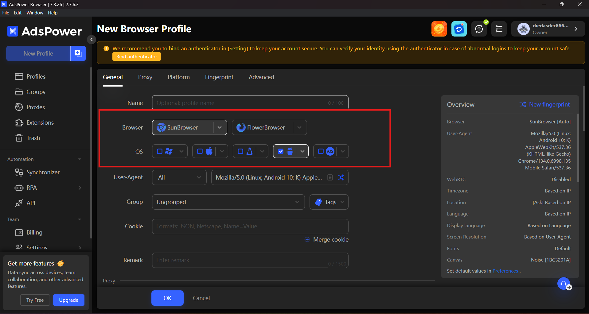
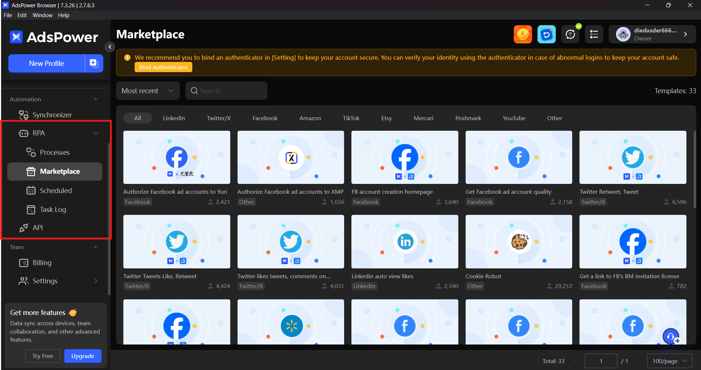
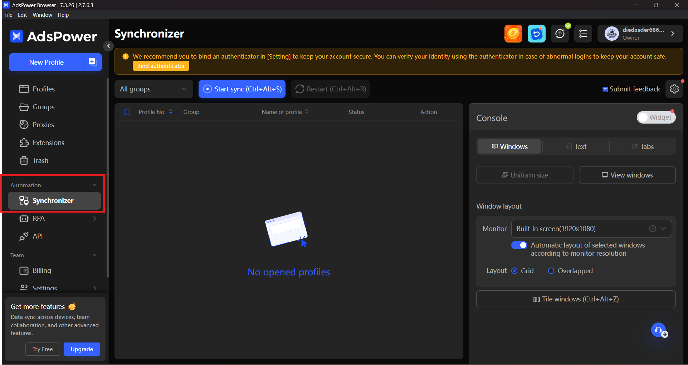
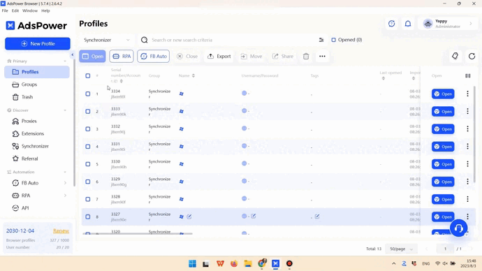
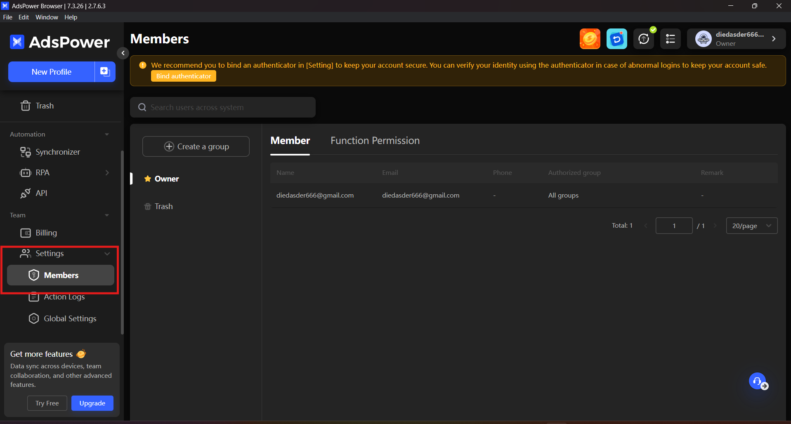
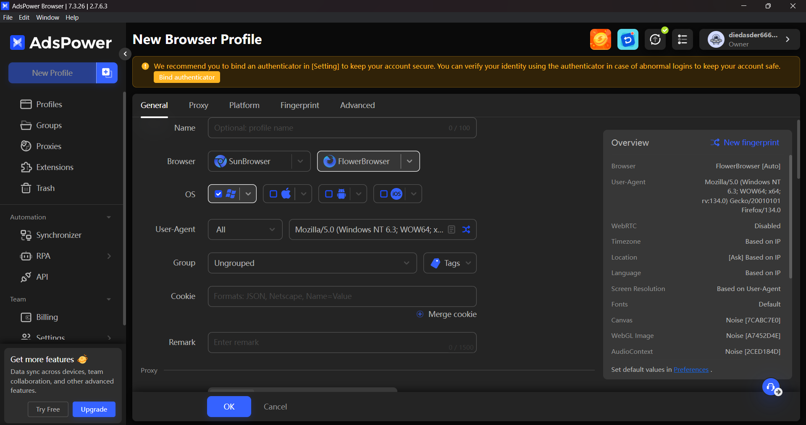
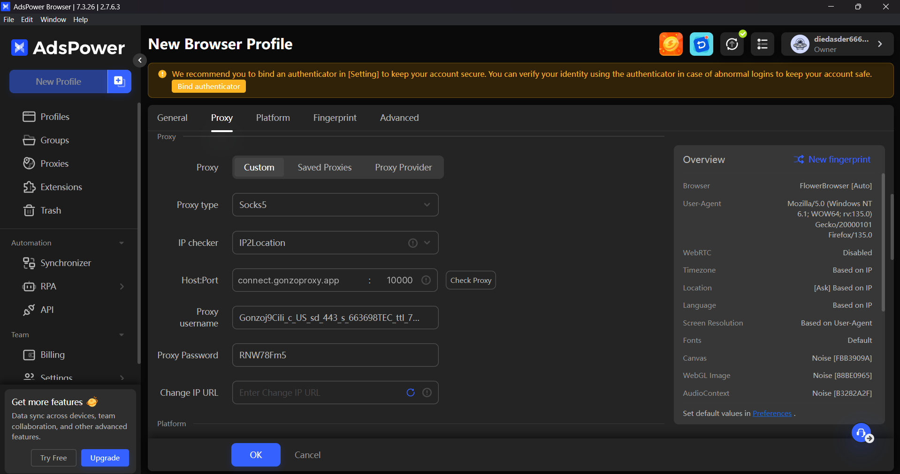
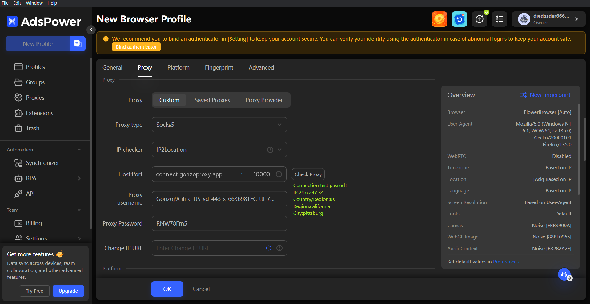
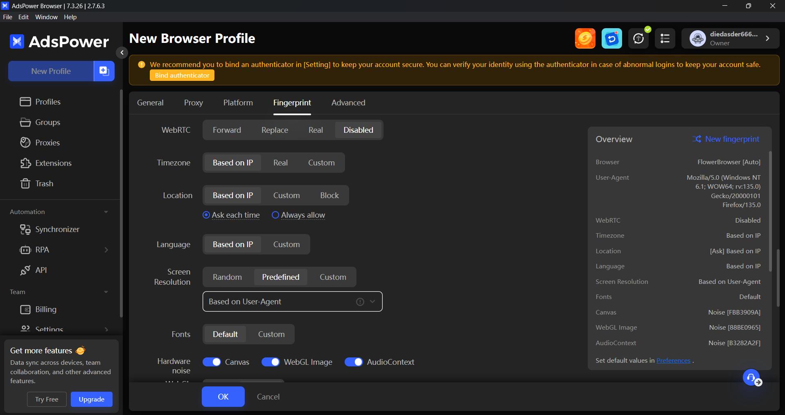
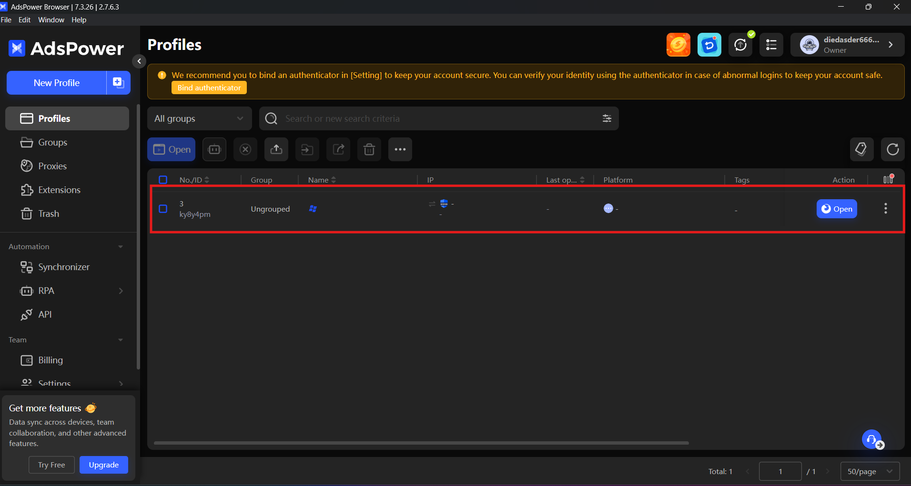

# 🔍 Setup AdsPower

AdsPower is an anti-detect browser that keeps each account in its own browser profile, and a proxy is what gives every profile a separate IP address. This page shows where to paste a GonzoProxy connection string.

***

### 🧠 **AdsPower features**

Besides the profile manager, AdsPower carries a few tools that come up in day-to-day work. Here is what each of them does.

***

#### 1. **Browser fingerprints** 🧬

Fingerprint settings go further than headers and user agents: you set the parameters of the whole device profile.

<figure><figcaption></figcaption></figure>

**What you can set:**

* **Mobile OS fingerprints:** desktop operating systems and mobile ones, Android and iOS.
* **Dual engine support:** a profile runs on either Chromium or Firefox.
* **Detailed customization:** GPU, WebGL, WebRTC, system language, fonts, device noise, screen resolution and other parameters. Each one can be set by hand.

***

#### 2. **Code-free automation** ⚙️

AdsPower includes RPA (Robotic Process Automation), so browser actions can be automated without writing code.

<figure><figcaption></figcaption></figure>

**Automation capabilities:**

* **Script-free scenarios:** build an automation sequence without writing code.
* **User actions:** clicks, page navigation, text input, logins and logouts, multi-account routines.
* **Templates:** start from a pre-built template instead of from scratch.

The scenario is assembled visually, step by step.

📎 **Learn more:** [AdsPower RPA Guide](https://www.adspower.com/blog/step-by-step-instructions-for-using-rpa-automation-from-adspower)

***

#### 3. **Synchronizer** 🧩

The Synchronizer repeats one action across several browser profiles at once, without scripts or extra plugins.

<figure><figcaption></figcaption></figure>

**Synchronizable actions:**

* **Navigation:** open links across profiles.
* **Text input:** type into fields simultaneously.
* **Form filling:** complete forms in bulk.
* **Clicks:** click buttons across profiles.
* **Extensions:** install browser extensions in bulk.

<figure><figcaption></figcaption></figure>

You act in the main window, and the action repeats in every profile connected to the session. Useful when the same task has to be done across a set of accounts.

📎 **Discover more:** [AdsPower Synchronizer](https://www.adspower.com/blog/post/Synchronizer)

***

#### 4. **Team collaboration** 👥

AdsPower has a built-in system for managing access and actions inside the browser.

<figure><figcaption></figcaption></figure>

**Team features:**

* **Permission levels:** define who can view or edit specific profiles.
* **Activity logs:** see who did what and when.
* **Task assignment:** split responsibilities between team members.

Useful when several people work with the same set of profiles.

***

### 💻 **Getting started with AdsPower**

**Installation Steps:**

1. **Download:** Visit the [official AdsPower website](https://www.adspower.com/) and click "Get Started."

<figure><figcaption></figcaption></figure>

2. **Choose OS:** Select the installer for your operating system (Windows or Mac).

<figure><figcaption></figcaption></figure>

3. **Install:** Open the downloaded file and follow the on-screen instructions. Mac users might need to grant installation permissions.

***

### 📝 **Setting up AdsPower**

**Registration process:**

1. **Launch AdsPower:** Open the application and click on "Sign Up."

<figure><figcaption></figcaption></figure>

2. **Fill Details:** Enter your email, create a password, input the verification code, and click "Register."

<figure><figcaption></figcaption></figure>

3. **Alternative Sign-Up:** You can also register using social accounts like Google, Facebook, or VK.

Once registered, you'll access your dashboard to create and customize profiles.

***

### 🔧 **Configuring AdsPower**

Setting up AdsPower involves four main components: **Profile**, **Proxy**, **Fingerprint**, and **Cookies**. Let's break it down:

***

#### 1. **Profile setup**

Each profile keeps its own browser environment and its own proxy.

<figure><figcaption></figcaption></figure>

**Steps:**

* **New Profile:** Click "New Profile" in the top-left corner.
* **Profile Name:** Choose a name like `fb_account_1` or `shop_test2`.
* **Browser:** Select between Chrome or Firefox.
* **Operating System:** Choose MacOS or Windows.
* **User-Agent:** Leave the automatic value.
* **Group:** Organize profiles into groups like "Google Ads Test."
* **Cookies:** Skip for now; we'll address this later.
* **Notes:** Add reminders like "Account for white-hat campaigns" or "For farming."

<figure><figcaption></figcaption></figure>

***

#### 2. **Adding a proxy**

A proxy gives the profile a separate IP address.

**Example:**

You've purchased US residential proxies from [GonzoProxy ](https://gonzoproxy.com/?utm_source=gitbook\&utm_medium=anti-detekt-brauzer-adspower)and received the following:

`Gonzoj9CiIi_c_US_sd_443_s_663698TEC_ttl_72h:RNW78Fm5@connect.gonzoproxy.app:10000`

<figure><figcaption></figcaption></figure>

**Configuration:**

* **Proxy Type:** Select SOCKS5 or HTTPS.
* **Host:** `connect.gonzoproxy.app`
* **Port:** `10000`
* **Username:** `Gonzoj9CiIi_c_US_sd_443_s_663698TEC_ttl_72h`
* **Password:** `RNW78Fm5`

<figure><figcaption></figcaption></figure>

***

#### ✅ **3. Proxy verification**

After entering the proxy details, click "Check Proxy."

A green checkmark means:

* The proxy answered.
* The IP address is live.
* You can save the profile.

<figure><figcaption></figcaption></figure>

If the check fails, double-check for typos or incorrect entries.

***

#### 4. **Fingerprint settings**

Set the fingerprint fields of the profile:

* **WebRTC:** Disable
* **Timezone:** Based on IP
* **Geolocation:** Based on IP
* **Language:** Based on IP
* **App Language:** Based on IP
* **Screen Resolution:** Predefined
* **Fonts:** Default
* **Hardware Noise:** Enable all
* **WebGL Metadata:** Set manually
* **WebGPU:** Based on WebGL

<figure><figcaption></figcaption></figure>

The profile is now configured.

<figure><figcaption></figcaption></figure>

***

### 📱 Stay Connected

* [Telegram Channel](https://t.me/GonzoProxy)
* [Telegram Chat ](https://t.me/GonzoProxy_Chat)
* [Instagram](https://www.instagram.com/gonzoproxy)
* [24/7 Support](https://t.me/GonzoProxy_bot)

💬 Our team is always here for you! Reach out anytime.
