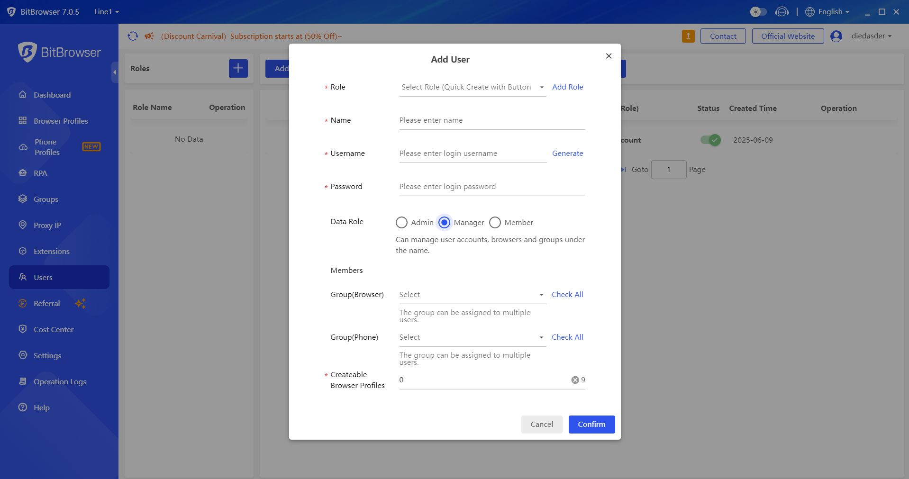
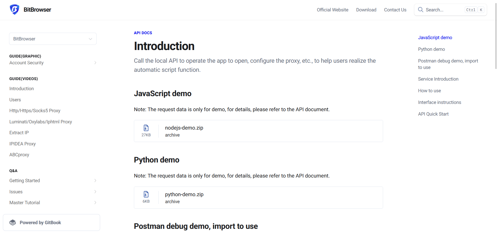
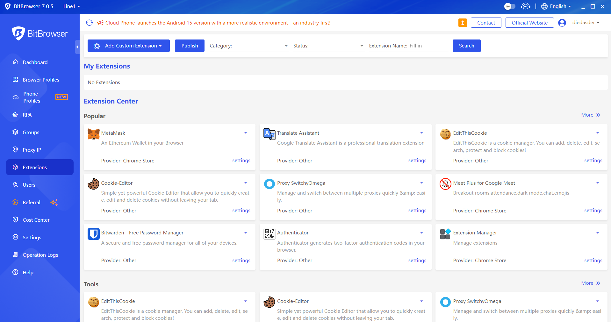
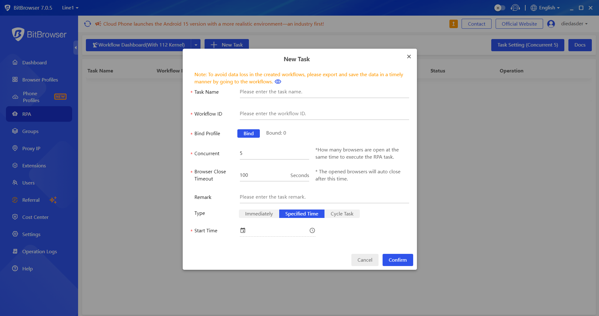
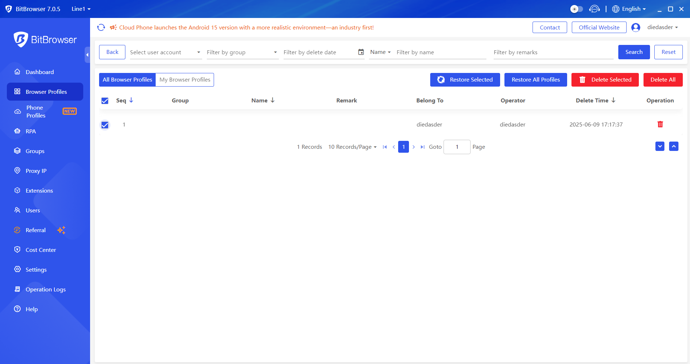
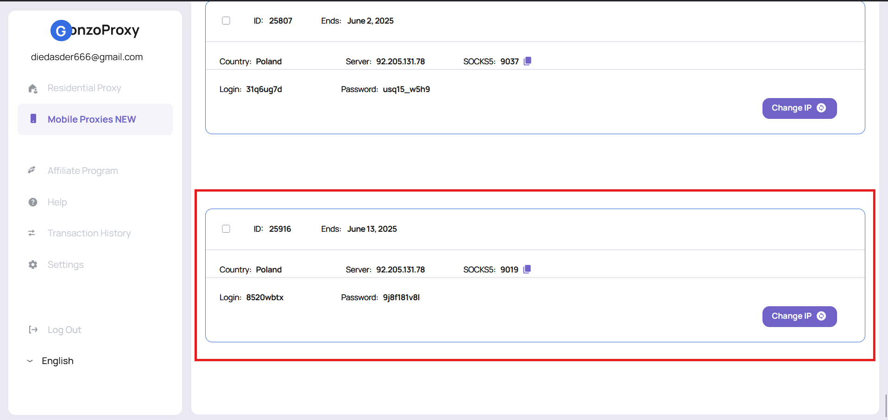
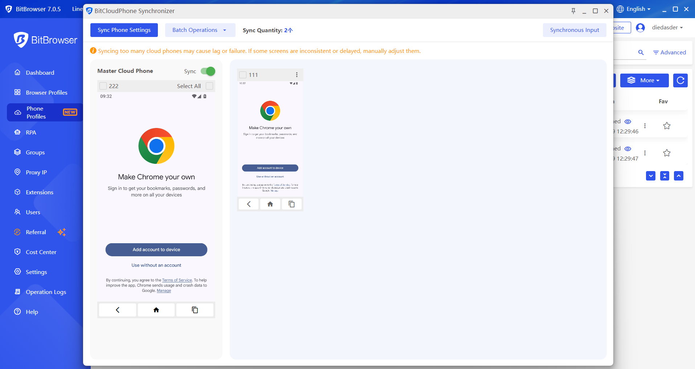
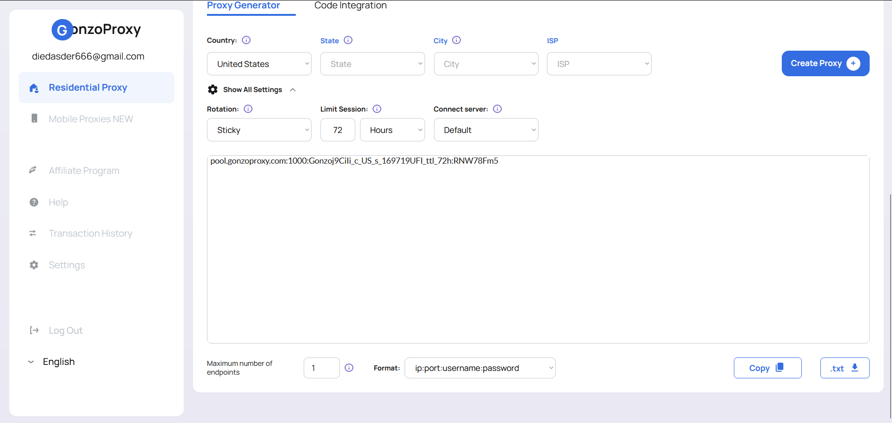
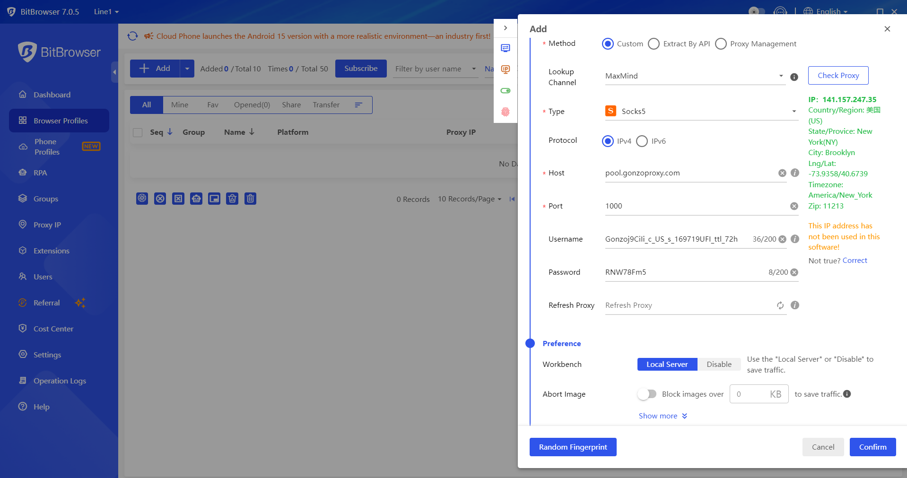

# 🚀 Setup BitBrowser

If you’re working with **multiple accounts**, automating processes, or just want to stay **under the radar online**, a good anti-detect browser is a must. One of the top tools for that is [**BitBrowse**](https://www.bitbrowser.net/)**r**. And to make sure your traffic is as **secure and stable** as possible, pair it with proxy services from the trusted provider —[ **GonzoProxy**](https://gonzoproxy.com/?utm_source=gitbook\&utm_medium=bitbrowser\&utm_content=eng).

**BitBrowser** lets you create individual browser profiles with unique _fingerprints_, simulating different devices and environments. This makes tracking difficult and allows you to scale any web tasks safely.

***

## 📌 Features of BitBrowser

### 👥 Team collaboration

BitBrowser is great for **team-based work**. Each team member uses a separate profile with a unique fingerprint, and all sessions are completely isolated. Profiles can be shared using the built-in export/import tool, making it easier to launch new workstations or transfer profiles between team members.

<figure><figcaption></figcaption></figure>

It also features **centralized management** for profiles and scripts, plus a flexible **permission system** 🔐 — so you can define exactly who has access to what.

***

### ⚙️ API

BitBrowser supports **API interaction**, allowing you to connect it with external systems and **automate** essential processes. You can use the local API to control the app: open the browser, configure proxies, create and launch profiles, and more — all without manual input.

<figure><figcaption></figcaption></figure>

The API makes it easy to **build scripts** or connect with other platforms.

> Full documentation is available [here](https://doc.bitbrowser.net/api-docs/introduction).

***

### 🧩 Extensions

If the built-in features aren’t enough, BitBrowser is easily **extendable**.

<figure><figcaption></figcaption></figure>

You can install ready-made solutions from the **Extension Center**, or build your own custom modules. This is especially helpful for integration with third-party systems, solving CAPTCHAs automatically, or tweaking the browser's behavior.

> Full documentation is available [here](https://doc.bitbrowser.net/help1/extensions).

***

### 🤖 RPA: no-code automation

To handle repetitive tasks, BitBrowser includes a built-in **RPA tool**. You can record browser actions like filling forms, clicking through pages, entering data, and replay those actions within selected profiles.

<figure><figcaption></figcaption></figure>

Because RPA works with profiles, all automation happens in the correct environment — with the right fingerprints and network settings. That reduces errors and helps with **mass task execution**.

> Full documentation is available [here](https://doc.bitbrowser.net/rpa/rpa-usage-guide).

***

### 📋 Operation logs

While you're working, BitBrowser logs all activity: visited pages, interactions, requests, and automation steps.

<figure><figcaption></figcaption></figure>

These logs are useful for monitoring team progress, reviewing profile activity, or even **restoring profile states** if needed. It makes team collaboration more reliable and transparent.

<figure><figcaption></figcaption></figure>

***

### 📱 Cloud phone Integration

BitBrowser integrates with **Cloud Phone**, which allows you to work with **virtual mobile devices**. This is especially helpful for testing mobile versions of websites, verifying geo-specific flows, or managing accounts that require real mobile environments.

<figure><figcaption></figcaption></figure>

***

### 🔧 Setting up a mobile profile with GonzoProxy mobile proxies

#### Step 1: Proxy Setup

Pick a country and proxy type in the **Mobile Proxies** section of your [**GonzoProxy dashboard**](https://gonzoproxy.com/?utm_source=gitbook\&utm_medium=bitbrowser\&utm_content=eng)**.**&#x20;

<figure><figcaption></figcaption></figure>

Copy the following details:

* **IP**: `92.205.131.78`
* **Port**: `9019`
* **Login**: `8520wbtx`
* **Password**: `9j8f181v8l`

<figure><figcaption></figcaption></figure>

#### Step 2: Create a mobile profile in BitBrowser

* Go to "New Profile" and choose **Mobile Device** as the type
* Set **Computing Power** to: _International B-15_
* Choose your **billing method**: Temporary or Monthly computing power

In the **basic settings**, fill out:

* Profile Name, Group, and optional notes
* Enter the proxy credentials (IP, port, login, password)
* Click **Check Proxy**
* Enable the **UDP** toggle

<figure><figcaption></figcaption></figure>

✅ **Proxies are working perfectly**

In fingerprint settings, enable toggles for: **Language**, **Time Zone**, and **Location**.

Your profile is now ready to run using a **real mobile proxy**.

***

### 🔄 Cloud phone sync tool

The sync tool lets you control **multiple Cloud Phone virtual devices** at once, syncing them with a main profile. Everything you do — mouse movements, keyboard input, app launches — is mirrored across all linked devices.

<figure><figcaption></figcaption></figure>

**Supports:**

* Synchronized text input (same or different)
* Bulk app install/removal
* Batch file upload and environment restarts

Switching between devices happens instantly — with **zero lag**.

> _👉 You need at least two environments with the **same computing power and billing model** to use the sync tool._
>
> Full documentation is available [here](https://doc.bitbrowser.net/cloud-phone/synchronizer/graphic).

***

### 🛠️ How to properly set up a browser profile

| Parameter                    | Description                                                       |
| ---------------------------- | ----------------------------------------------------------------- |
| **Profile Name**             | Name your profile                                                 |
| **Group**                    | Assign to a group for better organization                         |
| **Platform to log in**       | Specify the platform (e.g., Facebook, Twitter, TikTok, Instagram) |
| **Account login & password** | Add credentials for auto-login                                    |
| **Duplicate check**          | Turn this OFF to avoid profile duplication checks                 |
| **Multitasking**             | Enable to use the profile across multiple sessions                |
| **2FA Key (if any)**         | Insert two-factor authentication key for auto-login               |
| **Notes or Cookies**         | Add session notes or import cookies                               |
| **Startup Site**             | Enter a URL the browser should open at launch                     |

***

#### 🔌 Setting up GonzoProxy proxy

Get your residential proxy in the [**GonzoProxy Dashboard**](https://gonzoproxy.com/?utm_source=gitbook\&utm_medium=bitbrowser\&utm_content=eng)

<figure><figcaption></figcaption></figure>

In BitBrowser, set the following:

* **Method** — Manual
* **Type** — Socks5
* **IP** — IPv4
* Enter the details (host, port, username, password).
* Click **Check Proxy**

<figure><figcaption></figcaption></figure>

✅ **Proxies work great**

_If a proxy test fails, go to settings and select **"Do not use system proxy settings"**_

<figure><figcaption></figcaption></figure>

***

#### 🔧 Additional browser settings

* Homepage: _local_
* Image loading: _enabled_
* Sync tabs, cookies, and passwords: _enabled_
* Hardware acceleration: _enabled_

Other options can be left off by default.

***

#### 🛠️ Fine-tuning fingerprint settings

| Parameter                      | Value / Recommendation       |
| ------------------------------ | ---------------------------- |
| **Browser**                    | BitBrowser                   |
| **Core**                       | Don’t change (e.g., 134)     |
| **Device Type**                | PC / Android / iPhone        |
| **Operating System**           | Windows 11 (or your version) |
| **User Agent**                 | Don’t change                 |
| **Language & Time Zone**       | Enable                       |
| **WebRTC**                     | Mask                         |
| **Location**                   | Auto by IP                   |
| **Window Size**                | 1280x720                     |
| **Fonts, Canvas, WebGL, etc.** | Set randomly                 |
| **Port Scan Protection**       | Enabled                      |
| **Other Options**              | Leave disabled               |

***

Use the [**BitBrowser**](https://www.bitbrowser.net/) **+** [**GonzoProxy**](https://gonzoproxy.com/?utm_source=gitbook\&utm_medium=bitbrowser\&utm_content=eng) combo to manage **hundreds of accounts**, automate processes, and stay **completely undetectable online**. It’s a powerful solution for business, marketing, traffic arbitrage, and any project where **privacy is essential**.&#x20;

***

### 👾 Try it here: [GonzoProxy.com](https://gonzoproxy.com/?utm_source=gitbook\&utm_medium=bitbrowser\&utm_content=eng)

***

### 📱 Stay Connected

* [Telegram Channel](https://t.me/GonzoProxy)
* [Telegram Chat ](https://t.me/GonzoProxy_Chat)
* [Instagram](https://www.instagram.com/gonzoproxy)
* [24/7 Support](https://t.me/GonzoProxy_bot)

💬 Our team is always here for you! Reach out anytime — we’ll solve any issue within minutes.
