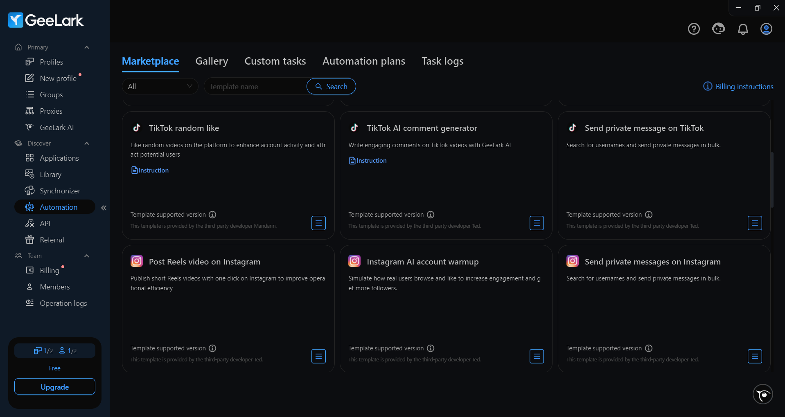

# ⚡️ Setup GeeLark

Scaling isn’t just about running more accounts. It’s about stability, invisibility, and accurately mimicking real user behavior. Today’s platforms look beyond the browser: into hardware, device behavior, networks, and environment. Emulators and anti-detect tools no longer cut it — too templated, too obvious.

**GeeLark** is a cloud-based Android that looks and works like a real smartphone. No anti-detect browser or emulator offers this level of realism. For apps and platforms, it’s a full-fledged physical device with all the technical specs.

***

### ⚙️ Setting up GeeLark with mobile proxies from GonzoProxy

#### Step 1: Choose your country and proxy type in the GonzoProxy dashboard

<figure><figcaption></figcaption></figure>

Copy:

* **IP** – `92.205.131.78`
* **Port** – `9037`
* **Login** – `31q6ug7d`
* **Password** – `usq15_w5h9`

<figure><figcaption></figcaption></figure>

#### Step 2: Create a new profile in GeeLark

<figure><figcaption></figcaption></figure>

Enter the proxy data you received from GonzoProxy and click **Check proxy**:

<figure><figcaption></figcaption></figure>

\
✅ Proxy works great

***

### Then configure your device parameters according to the proxy:

<figure><figcaption></figcaption></figure>

* **Operating System**: Android / iOS
* **OS Version**: Choose desired or current version
* **Location**: Auto-detect based on proxy IP
* **Device Brand**: Set to random
* **Device Model**: Random selection
* **Interface Language**: Auto-select based on IP

Once saved, the cloud device will be adapted to the proxy, and its parameters will closely mimic a real user from the selected region. This creates a clean digital footprint and reduces detection risk.

***

### 🔥 Extra features in GeeLark that speed up your workflow

#### 🔁 Synchronizer

<figure><figcaption></figcaption></figure>

It allows users to manage multiple cloud phones simultaneously. Actions performed in the main profile are automatically replicated across all connected profiles. This massively cuts down the time needed to perform the same task on multiple accounts.

_📌 Perfect for account warming and large-scale operations._

***

### 🤖 Ready-made automation templates&#x20;

<figure><figcaption></figcaption></figure>

GeeLark provides ready-to-use automation templates for popular apps like TikTok and Facebook. These templates can automate:

* Account login and setup
* Profile editing and configuration
* Content posting and scheduling
* Engagement actions (likes, follows, comments)
* Analytics tracking and reporting
* “Warming up” accounts to look natural

In **TikTok**, automation templates are especially powerful — supporting automatic login for multiple accounts, bulk profile editing (avatars, usernames, bios), video publishing schedules with batch editing, and human-like action emulation for natural warming.

***

### 🧠 GeeLark AI

<figure><figcaption></figcaption></figure>

GeeLark now features AI support powered by **DeepSeek**. This assistant helps with content creation and makes understanding and using GeeLark easier. Plus, feel free to ask the GeeLark AI anything else you need!

***

### 🧑‍🤝‍🧑 Features for Teams and Agencies

<figure><figcaption></figcaption></figure>

In GeeLark, you can create roles with different access levels for each team member and easily share profiles with any team participant, streamlining your workflow.

***

### ✅ Why this combo works❓

GeeLark gives you a real Android device.\
GonzoProxy gives you a real mobile IP.

* No overlap between accounts
* No leaks from geo, language, IP, or behavior
* No hacks or manual farming on dozens of phones

You work through a browser — but to the platform, it looks like a real phone user.\
Not just one, but dozens. And each one — clean.

**That’s what scaling without breaking looks like.**

***

### 👾 Try it here: [GonzoProxy.com](https://gonzoproxy.com)

***

### 📱 Stay Connected

* [Telegram Channel](https://t.me/GonzoProxy)
* [Telegram Chat ](https://t.me/GonzoProxy_Chat)
* [Instagram](https://www.instagram.com/gonzoproxy)
* [24/7 Support](https://t.me/GonzoProxy_bot)

💬 Our team is always here for you! Reach out anytime — we’ll solve any issue within minutes.

