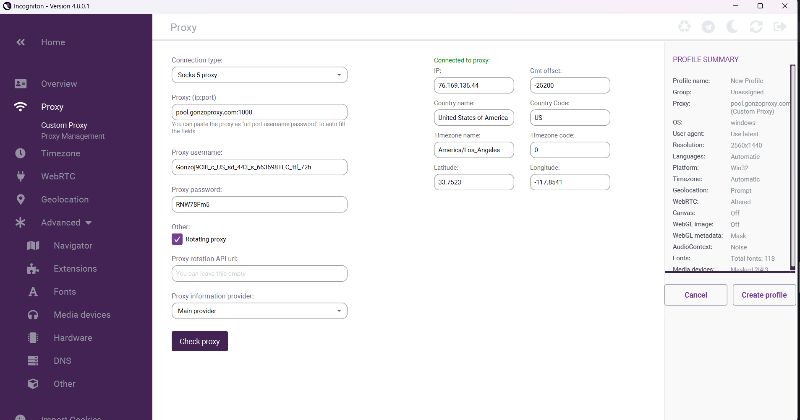

# 😎 Setup Incogniton

Working with multiple accounts — in affiliate marketing, marketplaces, or ad platforms? Then you know: even with perfectly set up profiles and content, bans often happen in a couple of days. Why? 🤔\
Modern anti-fraud systems track not just your user-agent or cookies but your entire digital "fingerprint." 🕵️‍♂️

[**Incogniton**](https://incogniton.com/) isn’t just a browser — it’s a powerful engine for creating profiles that look like real users. It masks WebRTC, Canvas, AudioContext, WebGL, and allows fine-tuned behavior customization.

But without a solid IP 🌍 (such as **residential proxies from** [**GonzoProxy**](https://gonzoproxy.com/?utm_source=gitbook\&utm_medium=eng\&utm_content=incogniton)), no masking will save you.

> ⚠️ Bad proxy = fast ban. 🚫

***

## 📌 Key features of Incogniton

### ✏️ Emulate manual input (Paste as Human Typing)

You paste text into a form, and the site immediately triggers a "bot check"?\
Here’s why: websites can detect not just that text was pasted, but _how fast_ it was entered. Instant pastes are a clear sign of a bot.

The **Paste as Human Typing** feature simulates keystrokes with delays between key presses — making it look like a human is typing.

**Usage:** Right-click → Paste as Human Typing.





***

### 🖼️ OCR — Copy text from images

Built-in **OCR** lets you quickly extract text from any image. Super handy for copying promo codes, instructions, or CAPTCHA text.

1️⃣ Right-click the image → Copy Text from Image\
2️⃣ Paste it where needed.





***

### ⚙️ Extensions

You can freely install any extensions in Incogniton. This is important because real users typically don’t browse with a blank browser.





***

### 🔁 Profile synchronizer

If you manage dozens of profiles, manually repeating settings is a nightmare.\
The **synchronizer** allows you to copy actions and parameters from one profile to others — saving tons of time.





***

### 👥 Team management

If you’re working in a team (affiliate marketing, agency, e-commerce), managing profiles becomes critical.

Since version **2.2.0.0**, Incogniton allows you to:

* Share profile groups
* Assign different access levels via roles
* Centrally manage all profiles





***

## How to set up Incogniton + GonzoProxy in practice

### 🚀 Step 1: Create a profile

* **Profile name:** any (e.g., US Ads Account)
* **Group:** optional
* **OS:** Windows / macOS / Linux
* **Browser core version:** default
* **Allow camera:** enabled
* **Set language based on IP:** enabled

***

### 🌍 Step 2: Connect residential proxy from GonzoProxy

Get a **residential proxy** (e.g., USA) in your [GonzoProxy dashboard](https://gonzoproxy.com/?utm_source=gitbook\&utm_medium=eng\&utm_content=incogniton). You’ll receive:

```
Gonzoj9CiIi_c_US_sd_443_s_663698TEC_ttl_72h:RNW78Fm5@pool.gonzoproxy.com:1000
```


<figure><figcaption></figcaption></figure>


Enter in Incogniton:

* **Host -** `pool.gonzoproxy.com`
* **Port -** `1000`
* **Login -** `Gonzoj9CiIi_c_US_sd_443_s_663698TEC_ttl_72h`
* **Password -** `RNW78Fm5`

✅ Enable **Rotating Proxy Server**.\
Test your proxy.


<figure><figcaption></figcaption></figure>


**Additional settings:**

* **Timezone:** by IP
* **WebRTC:** fake + WebRTC IP via proxy
* **Geolocation:** by proxy IP

***

### 🛠️ Step 3: Detailed settings

To make your profile "last" longer, here are some recommended parameters:

| Section       | Setting                                   | Status / Value |
| ------------- | ----------------------------------------- | -------------- |
| JS            | Modifications                             | Default        |
| Extensions    | Needed                                    | Add manually   |
| Fonts         | Font substitution                         | ✅ Enabled      |
| Media devices | Video output / Audio output / Audio input | 1:1:1          |
| Hardware      | Canvas / AudioContext / WebGL             | Masked         |
| DNS           | DNS                                       | Don’t touch    |

**Additional settings:**

| Parameter                    | Status / Value |
| ---------------------------- | -------------- |
| Block active session         | ✅ Enabled      |
| Show profile name in browser | ❌ Disabled     |
| Change browser language      | ✅ Enabled      |
| Chrome startup arguments     | ✅ Enabled      |
| Use webcam                   | ✅ Enabled      |
| IPhey check                  | ❌ Disabled     |
| Hide Chrome settings         | ❌ Disabled     |

***

### 🍪 Step 4: Import cookies

Don’t forget: **importing cookies** helps speed up profile warm-up and bypass some checks.\
Incogniton allows quick cookie imports for any required sites.





***

## Summary

[**Incogniton**](https://incogniton.com/) **+** [**GonzoProxy**](https://gonzoproxy.com/?utm_source=gitbook\&utm_medium=eng\&utm_content=incogniton) is a combo that really works.

Even the best antidetect won’t save you if you have a bad proxy. But when you combine:

* IP from a real device
* Proper fingerprint setup
* "Human-like" profile behavior

— your accounts get a real shot at long-term survival.

In today’s anti-fraud landscape, masking without a proxy is a ticking time bomb.\
**Never skimp on IPs** — they’re what sites use to "see" you.

***

### 👾 Try it here: [GonzoProxy.com](https://gonzoproxy.com/?utm_source=gitbook\&utm_medium=eng\&utm_content=incogniton)

***

### 📱 Stay Connected

* [Telegram Channel](https://t.me/GonzoProxy)
* [Telegram Chat ](https://t.me/GonzoProxy_Chat)
* [Instagram](https://www.instagram.com/gonzoproxy)
* [24/7 Support](https://t.me/GonzoProxy_bot)

💬 Our team is always here for you! Reach out anytime — we’ll solve any issue within minutes.
