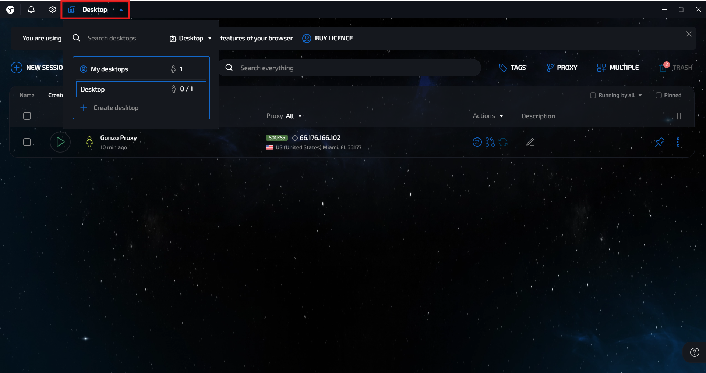

# 🔘 Setup Linken Sphere 2

If you’ve been working with traffic for a few years, you’ve surely heard of Linken Sphere, it was one of the first anti-detect browsers on the market that let you manage dozens of accounts from one application.

However, Linken Sphere hadn’t received significant updates for a long time and started to fall behind more modern competitors. The situation changed dramatically with the release of Linken Sphere Evolution a little over a year ago. The developers took customer feedback into account, updated the browser, and returned it to the level of leading solutions.

But the Sphere team didn’t stop there, just recently, [Linken Sphere 2](https://ls2.app/) was introduced. This isn’t just another update, it’s a completely reimagined browser that combines everything great from previous versions and incorporates the wishes of experienced users.

📌 **Important**: a profile needs a proxy. Residential and mobile proxies for it are taken from the [**GonzoProxy**](https://gonzoproxy.com/?utm_source=gitbook\&utm_medium=eng\&utm_content=linkensphere) dashboard.

***

### ⚙️ Main advantages of Linken Sphere 2

#### 🤖 Automatic account warming

Forget about manually generating cookies. With the new “Warming Tool,” the browser performs actions that closely resemble those of a real user, thereby creating high-quality cookies for your sessions.

<figure><figcaption></figcaption></figure>

➡️ To start warming, simply select the desired profile, click **“Actions” → “Warm Up”**.

<figure><figcaption></figcaption></figure>

***

#### 👥 Convenient team collaboration

Linken Sphere 2 makes team collaboration as convenient as possible. Configure roles, permissions, and access directly in the browser interface. Creating teams now takes just a few seconds, simply click the anti-icon in the upper-left corner of the screen.

<figure><figcaption></figcaption></figure>

***

### 🛠️ Additional features for comfortable work

#### 📱 Mobile device emulation

Linken Sphere 2 allows you to emulate mobile devices, a fairly rare feature even among anti-detect browsers. To enable this mode, select **“Mobile Preset”** from the dropdown on the homepage.

<figure><figcaption></figcaption></figure>

Then, when creating a new session, you can choose the version of Android or iOS, as well as the type of mobile browser.

***

#### 🖥️ Desktops

If you work with many accounts, the **“Desktops”** feature helps organize the process. In Linken Sphere 2, you can create an unlimited number of desktops, each isolated: profiles created on one desktop are not visible on others. This is convenient for separating projects, teams, or traffic directions.&#x20;

<figure><figcaption></figcaption></figure>

***

#### 🧩 Profile templates (Presets)

You can pre-create profile templates for quick session launches. To do this, click the **“Desktop Preset”** button and select **“Create Preset.”** In the template, you configure cookies, fingerprints, extensions, and other parameters. Later, you can launch new accounts in just a few clicks, saving time on routine.

<figure><figcaption></figcaption></figure>

***

### 🧾 How to create and configure a profile with GonzoProxy?

1. Disable **“Quick Mode”**.

<figure><figcaption></figcaption></figure>

2. We choose Desktop or Mobile preset (in our case, Desktop)
3. Give the profile a convenient name and assign tags.
4.  Connect the proxy:

    * Log in to your [**GonzoProxy**](https://gonzoproxy.com/?utm_source=gitbook\&utm_medium=eng\&utm_content=linkensphere) personal account.
   * Select **residential proxies** or **mobile proxies**, depending on the preset you picked (residential in our case).
    * Set the format: `ip:port@login:password`.

<figure><figcaption></figcaption></figure>

* Click **Create Proxy** and receive it in that format: `connect.gonzoproxy.app:10000@Gonzoj9CiIi_c_US_s_3083DDV_ttl_72h:RNW78Fm5`

<figure><figcaption></figcaption></figure>

5. Paste the proxy into **Linken Sphere 2** → click **“Check”**.

<figure><figcaption></figcaption></figure>

6. The proxy check passed. Don’t forget to enable **auto geolocation detection**.
7. Add cookies, extensions, or connect **cloud sync** for teamwork.

### 🔒 Profile fingerprint settings

| Fingerprint  | Setting  |
| ------------ | -------- |
| Profile Type | Desktop  |
| Canvas       | Enabled  |
| WebGL        | Noise    |
| ClientRects  | Noise    |
| Audio        | Disabled |
| WebGPU       | Fake     |
| MediaDevices | Fake     |

8. Leave other settings unchanged.

The profile is ready to use.

***

### ✅ Conclusion

In [**Linken Sphere 2**](https://ls2.app/) the [**GonzoProxy**](https://gonzoproxy.com/?utm_source=gitbook\&utm_medium=eng\&utm_content=linkensphere) connection string is pasted into the proxy field of a profile in the `ip:port@login:password` format, and the **Check** button in the same window verifies it.

***

### 👾 Try it here: [GonzoProxy.com](https://gonzoproxy.com/?utm_source=gitbook\&utm_medium=eng\&utm_content=linkensphere)

***

### 📱 Stay Connected

* [Telegram Channel](https://t.me/GonzoProxy)
* [Telegram Chat ](https://t.me/GonzoProxy_Chat)
* [Instagram](https://www.instagram.com/gonzoproxy)
* [24/7 Support](https://t.me/GonzoProxy_bot)

💬 Our team is always here for you! Reach out anytime.
