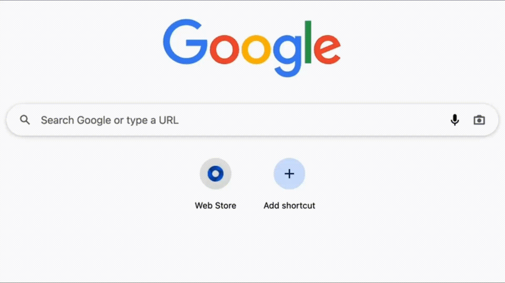

# 🛡️ Setup Multilogin X

This page shows how to set up a profile in **Multilogin X** and connect residential or mobile proxies from [**GonzoProxy**](https://gonzoproxy.com/?utm_source=gitbook\&utm_medium=eng\&utm_content=multilogin) to it.

[**Multilogin X**](https://multilogin.com/) creates a separate browser environment for each account, with its own fingerprint settings and its own proxy. It supports team collaboration, automates routine tasks and scales to a large number of profiles.

> 🔍 Let’s take a closer look at why **Multilogin X** is worth your attention.

***

## ✨ What makes Multilogin X stand out?

### 1. Simple team management 👥

When you're working with multiple people on a project, clearly assigning roles is essential. Multilogin makes this simple and intuitive. There are four access levels: Owner, Manager, Operator, and Starter.

**Access Overview**

| Feature                         | Manager | Operator | Starter  |
| ------------------------------- | ------- | -------- | -------- |
| Folder access                   | All     | Assigned | Assigned |
| Create profiles                 | ✅       | ✅        | 🚫       |
| Edit profiles                   | ✅       | ✅        | 🚫       |
| Launch profiles                 | ✅       | ✅        | ✅        |
| Move profiles between folders   | ✅       | ✅        | 🚫       |
| Work with notes                 | ✅       | ✅        | 🚫       |
| Trash (delete/restore profiles) | ✅       | ✅        | 🚫       |
| Manage users                    | ✅       | 🚫       | 🚫       |

Everyone now knows exactly what they can and cannot do, no confusion, no chaos.

***

### 2. AI commands / automate tasks in seconds 🤖

Ever wished managing hundreds of accounts could be easier? Multilogin X integrates AI tools that let you run up to 10 tasks from a single text prompt!



✅ **What you can automate:**

* **Profile launch**: instantly start any number of profiles.
* **Proxy management**: assign, change, or delete proxies with a simple command.
* **Profile grouping**: move profiles between folders without clicking through menus.

This saves hours of manual work.

***

### 3. Cloud and local storage options 📦

Multilogin X offers two data storage modes:

| **Feature**      | **Cloud Profiles**                                                                                                                                               | **Local Profiles**                                                                                              |
| ---------------- | ---------------------------------------------------------------------------------------------------------------------------------------------------------------- | --------------------------------------------------------------------------------------------------------------- |
| **How It Works** | Profiles are downloaded once and then quickly launched from cache. If any profile data changes after launch, it will need to sync again before the next session. | Profiles are downloaded to your device at first launch and then run from your local storage.                    |
| **Storage**      | Both metadata and profile data are stored in the AWS cloud.                                                   | Profile data (cookies, extensions, etc.) is stored locally on your device. Metadata is stored in the AWS cloud. |
| **Advantages**   | Profiles are always synchronized. Ideal for team collaboration and multi-device access.                                                                          | Profiles launch instantly every time. Best suited for solo users working on a single device.                    |

You get to choose what fits your workflow best

***

### 4. Paste as Human / realistic text input ✍️

Platforms like Gmail can detect when you're pasting text instead of typing it. Multilogin X has thought of that. The **Paste as Human** feature enters the pasted text with delays between keystrokes instead of inserting it all at once. Just right-click and choose **Paste as Human**.

<figure><figcaption></figcaption></figure>

***

### 5. API Integration with Selenium and Puppeteer 🧰

If you work with large-scale automation or manage many accounts, you’ll appreciate Multilogin X's robust API support, fully compatible with **Selenium** and **Puppeteer**.


📚 Detailed documentation available via [link](https://multilogin.com/help/en_US/api).


***

### 🧩 How to set up a profile and connect a GonzoProxy proxy in Multilogin X

Now for the fun part! Here’s a step-by-step guide to setting up a profile with a **GonzoProxy** proxy:

* **Profile name**: Choose a clear, descriptive name.
* **Load cookies**: Upload your cookies if you have them.

#### ⚙️ Proxy Setup:

* Go to your [**GonzoProxy dashboard**](https://gonzoproxy.com/?utm_source=gitbook\&utm_medium=eng\&utm_content=multilogin)
* Create a proxy in the format: `ip:port:login:password`

<figure><figcaption></figcaption></figure>

* You’ll get a string like this:
  `connect.gonzoproxy.app:10000:Gonzoj9CiIi_c_US_s_449664AHN_ttl_72h:RNW78Fm5`

<figure><figcaption></figcaption></figure>

* When setting up a profile in Multilogin, go to the **“My Proxies”** section
* Select the type: **http** or **socks5** _(GonzoProxy proxies support both protocols by default)_
* Enter the proxy details in the provided&#x20;

<figure><figcaption></figcaption></figure>

### 📋 Multilogin X profile configuration table

| **Parameter**            | **Recommended Setting**                    |
| ------------------------ | ------------------------------------------ |
| Tags or Notes            | Optional                                   |
| Browser                  | MimicX                                     |
| Storage                  | Cloud, for team use Local, for solo work   |
| Timezone                 | Mask                                       |
| Browser Language         | Mask                                       |
| WebRTC                   | Mask                                       |
| Screen Resolution        | Mask                                       |
| Geolocation Access       | Allow                                      |
| Geolocation Data         | Mask                                       |
| Media Devices            | Mask                                       |
| WebGL/WebGPU Metadata    | Mask                                       |
| WebGL Graphics           | Mask                                       |
| Canvas Graphics          | Noise                                      |
| AudioContext             | Noise                                      |
| Navigator                | Mask                                       |
| Port Scanning Protection | Mask                                       |
| Font Data                | Mask                                       |

***

### ✅ Conclusion

In Multilogin X the [**GonzoProxy**](https://gonzoproxy.com/?utm_source=gitbook\&utm_medium=eng\&utm_content=multilogin) connection string goes into the **My Proxies** section in the `ip:port:login:password` format, with the type set to **http** or **socks5**.

***

### 👾 Try it here: [GonzoProxy.com](https://gonzoproxy.com/?utm_source=gitbook\&utm_medium=eng\&utm_content=multilogin)

***

### 📱 Stay Connected

* [Telegram Channel](https://t.me/GonzoProxy)
* [Telegram Chat ](https://t.me/GonzoProxy_Chat)
* [Instagram](https://www.instagram.com/gonzoproxy)
* [24/7 Support](https://t.me/GonzoProxy_bot)

💬 Our team is always here for you! Reach out anytime.
