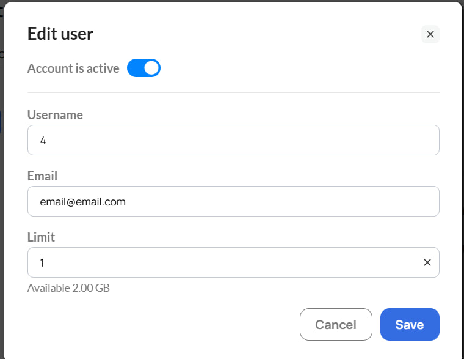

# 👥 Sub Users

**Sub Users** are additional accounts within your main GonzoProxy account. This feature lets you share traffic with team members and control access to your shared balance. You can also use Sub Users for personal purposes by creating separate accounts for different tasks or use cases under a single main account.

***

#### 1.  How to create a sub-account

**Step 1.** Go to the **Sub Users** tab in the dashboard menu.

<figure><figcaption></figcaption></figure>

**Step 2.** Click the **Add User** button.

<figure><figcaption></figcaption></figure>

**Step 3.** Enter the amount of GB you want to allocate to this account, specify the account name and the email address that will be used to sign in to the sub-account, then click **Save**.


Login details for the new GonzoProxy sub-account will be sent to the specified email address. Once received, the user can log in to the dashboard and use the sub-account independently under the main account.


<figure><figcaption></figcaption></figure>

The system will create the account automatically.

<figure><figcaption></figcaption></figure>

***

#### Table fields explained

<figure><figcaption></figcaption></figure>

| Field    | Description                                   |
| -------- | --------------------------------------------- |
| Username | Name of the sub-account                       |
| Login    | Login of the sub-account                      |
| Password | Proxy password for this account               |
| Limit    | Allocated traffic limit (GB)                  |
| Used     | How many GB have been used                    |
| Status   | Current account status (active / deactivated) |
| Actions  | Account management                            |

***

#### 2. Account management

In the **Actions** column next to each sub-account, the following options are available:

* Deactivate the account
* Change the name of the sub-account
* Change the email address
* Modify the traffic limit

<figure><figcaption></figcaption></figure>

* **Deactivation** instantly stops the account and all proxies running on it. This is the first step when offboarding a team member: the employee loses access immediately. 
* Changing the sub-account name allows you to rename the account at any time for easier management and identification within the team. 
* **Change Email** allows you to assign a new email address to a sub-account. Once updated, the owner of the specified email address will be able to use it to sign in to that sub-account. 
* **Editing the limit** allows you to increase or decrease the GB on a specific sub-account at any time. This is how a team lead manually reclaims unused traffic from an offboarded employee: set the limit to zero, then redistribute the freed-up GB to other team members.

The **Actions** field also includes the option to delete a sub-account.

<figure><figcaption></figcaption></figure>

***

#### 3. How to create proxies for a sub-account

**Step 1.** Once the account is created, go to the **proxy generator** and select the relevant sub-account from the dropdown.

<figure><figcaption></figcaption></figure>

**Step 2.** Configure the parameters: choose the country and set the rotation mode. You can also set the region, city and provider.

<figure><figcaption></figcaption></figure>

**Step 3.** Click **Create Proxy**, the proxies will appear in the list and will operate within the selected account's traffic limit.

***


💡 Tip: sub-accounts are convenient for teams where several employees work with proxies independently. Each sub-account draws from its own allocated limit.


***

### 👾 Try it here: [GonzoProxy.com](https://gonzoproxy.com)

***

### 📱 Stay Connected

* [Telegram Channel](https://t.me/GonzoProxy)
* [Telegram Chat ](https://t.me/GonzoProxy_Chat)
* [Instagram](https://www.instagram.com/gonzoproxy)
* [24/7 Support](https://t.me/GonzoProxy_bot)

💬 Our team is always here for you! Reach out anytime.
