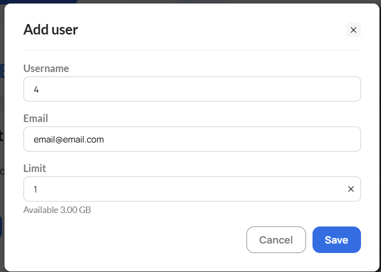

# 👥 Субаккаунты

**Субаккаунты** создаются внутри вашего основного аккаунта GonzoProxy. Они позволяют распределять трафик между членами команды и ограничивать доступ к общему балансу. Субаккаунты подходят и для личных задач: под каждую задачу можно завести отдельный субаккаунт в рамках одного основного аккаунта.

***

#### 1. Как создать субаккаунт

**Шаг 1.** Перейдите на вкладку **Sub Users** в меню панели управления.

<figure><figcaption></figcaption></figure>

**Шаг 2.** Нажмите кнопку **Добавить пользователя**.

<figure><figcaption></figcaption></figure>

**Шаг 3.** Введите количество GB, которые хотите выделить на этот субаккаунт, укажите имя, email, через который можно будет войти в субаккаунт, и нажмите **Save**.&#x20;


На указанный email будут отправлены данные для входа в новый субаккаунт GonzoProxy. После получения логина и пароля пользователь сможет войти в личный кабинет и работать в субаккаунте отдельно, в рамках основного аккаунта.


<figure><figcaption></figcaption></figure>

Система начнёт создание аккаунта автоматически.

<figure><figcaption></figcaption></figure>

***

#### Что означают поля в таблице

<figure><figcaption></figcaption></figure>

| Поле     | Описание                                          |
| -------- | ------------------------------------------------- |
| Username | Имя субаккаунта                                   |
| Login    | Логин субаккаунта                                 |
| Password | Пароль от прокси этого аккаунта                   |
| Limit    | Выделенный лимит трафика (GB)                     |
| Used     | Сколько GB уже использовано                       |
| Status   | Текущий статус аккаунта (активен / деактивирован) |
| Actions  | Управление аккаунтом                              |

#### 2. Управление аккаунтом

В столбце **Actions** напротив каждого субаккаунта доступно:   

* Деактивация аккаунта
* Изменение имени субаккаунта
* Изменение email
* Изменение лимита трафика

<figure><figcaption></figcaption></figure>

* **Деактивация** мгновенно останавливает аккаунт и все прокси, которые на нём работают. Это первое действие при увольнении сотрудника: сотрудник теряет доступ немедленно. 
* **Изменение имени** субаккаунта позволяет в любой момент переименовать его для более удобного управления и идентификации внутри команды. 
* **Изменение email** позволяет назначить новый адрес электронной почты для субаккаунта. После изменения владелец указанного email сможет использовать его для входа в этот субаккаунт. 
* **Изменение лимита** позволяет в любой момент увеличить или уменьшить объём GB на конкретном субаккаунте. Именно через это действие тимлид вручную забирает неиспользованный трафик уволенного сотрудника: нужно обнулить лимит и перераспределить освободившиеся GB на других участников команды.

В поле **Actions** также доступна функция удаления субаккаунта.

<figure><figcaption></figcaption></figure>

***

#### 3. Как создать прокси для субаккаунта

**Шаг 1.** После создания субаккаунта перейдите в **генератор прокси** и выберите нужный субаккаунт из выпадающего списка.

<figure><figcaption></figcaption></figure>

**Шаг 2.** Настройте параметры: выберите страну и укажите режим ротации. Можно задать также регион, город и провайдера.

<figure><figcaption></figcaption></figure>

**Шаг 3.** Нажмите Создать прокси. Готовые прокси появятся в списке и будут работать в рамках лимита выбранного субаккаунта.

***


💡 Совет: субаккаунты удобны для команд, где несколько сотрудников работают с прокси независимо друг от друга. Каждый субаккаунт расходует свой выделенный лимит.


***

### 👾 Попробовать можно здесь: [GonzoProxy.com](https://gonzoproxy.com)

***

### 📱 Мы на связи

* [Telegram-канал ](https://t.me/GonzoProxy)
* [Telegram-чат ](https://t.me/GonzoProxy_Chat)
* [Instagram](https://www.instagram.com/gonzoproxy)
* [Поддержка 24/7 ](https://t.me/GonzoProxy_bot)

💬 Наша команда всегда на связи! Обращайтесь в любое время суток.
