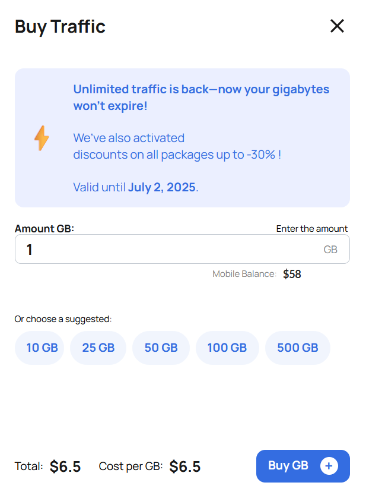

# 💻 Резидентские прокси GonzoProxy

🏠 Что такое резиденсткие прокси? 
-------------------------------------

<figure><figcaption></figcaption></figure>

**Резидентские прокси** — это IP-адреса из масштабной **P2P-сети**, объединяющей более **20 миллионов реальных устройств** обычных интернет-пользователей по всему миру.

В отличие от **дата-центр прокси**, которые легко распознаются системами безопасности, резидентские прокси **неотличимы от настоящих пользователей**. Это позволяет им **эффективно обходить блокировки**, антифрод-системы и другие ограничения.

***

### ⚙️ Технология и «чистота» IP-адресов

#### 🔌 Принцип работы нашей сети:

* **Уникальная P2P-технология** — пользователи добровольно устанавливают наше SDK-приложение на свои компьютеры и мобильные устройства
* **Взаимовыгодное сотрудничество** — владельцы устройств делятся частью своего интернет-канала и получают вознаграждение
* **Прямое подключение** — вы подключаетесь через реальные устройства и **наследуете их репутацию и статус**

***

#### ✅ Почему наши IP-адреса считаются «чистыми» и надёжными:

* **Реальная цифровая история** — каждый IP имеет естественный паттерн использования и репутацию обычного пользователя
* **Только домашние и мобильные подключения** — мы не используем серверные IP
* **Многоступенчатая фильтрация** — система автоматически отсеивает IP с блокировками и плохой историей
* **Постоянное обновление пула** — регулярно добавляются новые IP и исключаются подозрительные адреса
* **До 90% чистоты IP** — подавляющее большинство адресов имеют **низкий фрод-скор** в системах защиты

***

### ✅ Резидентские прокси помогают:

* создавать аккаунты без блокировок
* продвигать SEO
* работать с рекламными кабинетами
* покупать лимитированные вещи быстрее всех
* разрабатывать и тестировать софт

***

## 💰 Как начать пользоваться резидентскими прокси?

### 🔹 Шаг 1. Покупка трафика

* Покупаем трафик в гигабайтах
* У него **нет срока годности**
* Тарификация — только за **потраченный трафик**

💲 Цена за 1 ГБ зависит от объёма покупки: **от $6,5 до $2**

<figure><figcaption></figcaption></figure>

#### 🔸 Способы оплаты

* 💳 **Банковская карта** (мгновенное зачисление)
* 💰 **Криптовалюта** (поддерживаем 20+ валют)

<figure><figcaption></figcaption></figure>

💡 После оплаты купленный трафик появится **в правом верхнем углу** личного кабинета.

<figure><figcaption></figcaption></figure>

## 🧩 Шаг 2. Настройка прокси

В окне **Proxy Setup** вы можете сгенерировать прокси с нужными параметрами для любых задач.

***

### 🌍 Country — Страна

Выберите страну, из которой будут IP-адреса.\
**Доступно более 150 стран.**

***

### 🏙️ City / State / ISP — Город / Регион / Провайдер

Тонкая геонастройка по городу, региону или интернет-провайдеру.

* **ISP (интернет-провайдер)** — это компания, предоставляющая доступ в интернет (например, _Comcast, AT\&T, Vodafone_)
* **Рекомендация:** при работе с аккаунтами выбирайте **либо город**, **либо провайдера**, а не оба — это обеспечит стабильную смену IP с сохранением "цифрового следа"

***

### 🔄 Rotation — Режим смены IP

Выберите, как часто будет меняться IP-адрес:

#### • **Sticky (липкая сессия)**

* IP сохраняется до **72 часов** или до отключения устройства
* **Идеально для:** аккаунтов, рекламных кабинетов, длительных сессий
* **Как работает:** система закрепляет за вами один IP и удерживает его максимально долго

#### • **Randomize IP**

* Каждый запрос будет выполняться с **новым IP**
* **Идеально для:** парсинга, скрапинга, автоматизации, анонимного серфинга
* **Как работает:** на каждый запрос вы получаете случайный IP из выбранного пула

***

### 🔧 Protocol — Протокол подключения

Выберите протокол, который будет использоваться:

* **HTTPS**
* **SOCKS5**\
  Все резидентские прокси GonzoProxy поддерживают оба варианта.

***

### ⏳ Limit Session — Ограничение времени сессии

Устанавливает, сколько времени один IP будет закреплён за вами.

* После истечения времени IP **автоматически меняется**
* **Рекомендованные значения:**
  * 24–72 ч — стабильная работа с аккаунтами
  * 5–30 мин — периодическая смена IP
  * 1–2 ч — стандартные задачи

***

### 🖥️ Server — Регион прокси-сервера

Влияет только на **скорость соединения**, не на сам IP.

* **Стандартный** — автоопределение оптимального сервера
* **Европа / Азия / США** — выберите ближайший регион для лучшей скорости

<figure><figcaption></figcaption></figure>

#### 🔧 Пример настройки:

**Цель:** создать прокси с IP из Армении, с лимитом сессии 72 часа.\
**Результат:** система будет удерживать один IP как можно дольше, а затем заменит его на максимально похожий IP из того же региона.

***

### 🌐 Шаг 3. Используем прокси в антидетект-браузере

* Загружаем созданные прокси в анти-детект браузер (например, **Dolphin Anty**)
* Создаём **новый профиль** и указываем наш прокси
* Проверяем прокси на работоспособность

<figure><figcaption></figcaption></figure>

### 🔎 Шаг 4. Тестируем работу

Проверяем доступ к популярным сайтам:

* 📩 Gmail
* 📘 Facebook
* 💰 Binance
* 📸 Instagram

📍 Дополнительно проверяем IP и страну на **whoer.net** — всё корректно 🎯

<figure><figcaption></figcaption></figure>

### 🎉 Готово!

Теперь вы можете пользоваться резидентскими прокси без каких-либо проблем.

***

## 🧠 Экспертные советы для профессионалов

Полезные рекомендации для более безопасной, быстрой и эффективной работы с резидентскими прокси.

***

### 🔐 Максимизация безопасности

* **Золотое правило:**\
  **1 прокси = 1 аккаунт** — никогда не используйте один IP-адрес для нескольких аккаунтов в одном сервисе
* **Умный таргетинг:**\
  Выбирайте **либо город**, либо **провайдера** (не оба одновременно) — это повышает стабильность при смене IP
* **Стратегия ротации:**\
  Для критически важных аккаунтов рекомендуется устанавливать **лимит сессии 24–48 часов**, а не максимальные 72

***

### ⚙️ Оптимизация производительности

* **Экономия трафика:**\
  Отключите загрузку изображений, видео и тяжёлых скриптов — это сэкономит до **40% трафика**
* **Ускорение парсинга:**\
  При масштабном скрапинге используйте **несколько прокси одновременно**, равномерно распределяя нагрузку
* **Снижение задержек:**\
  Выбирайте **сервер, географически ближайший** к вам — это уменьшит пинг и увеличит скорость отклика

***

### 🎯 Советы для конкретных задач

* **Рекламные аккаунты:**\
  Используйте IP-адреса из **того же региона**, где расположена ваша целевая аудитория
* **Социальные сети:**\
  Поддерживайте **постоянные параметры подключения** (один и тот же IP/локаль) для каждого аккаунта
* **E-commerce / дропы:**\
  При покупке лимитированных товаров используйте **разные IP из одного города** для создания естественного поведения

***

### 🛠️ Технические особенности

* При отключении устройства-донора, система **автоматически подберёт аналогичный IP** на основе заданных параметров
* Создание **неограниченного количества прокси** — вы платите **только за использованный трафик**
* **Полная совместимость** со всеми популярными инструментами, парсерами и платформами
* **Поддержка 24/7** в Telegram: [@gonzoproxy\_bot](https://t.me/gonzoproxy_bot) — ответ в течение нескольких минут

***

### 🚀 Начните сегодня

Используйте преимущества резидентских прокси **GonzoProxy** и **забудьте о блокировках, антифроде и ограничениях**.

***

### 👾 Попробовать можно здесь: [GonzoProxy.com](https://gonzoproxy.com)

***

### 📱 Мы на связи

* [Telegram-канал ](https://t.me/GonzoProxy)
* [Telegram-чат ](https://t.me/GonzoProxy_Chat)
* [Instagram](https://www.instagram.com/gonzoproxy)
* [Поддержка 24/7 ](https://t.me/GonzoProxy_bot)

💬 Наша команда всегда на связи! Обращайтесь в любое время суток — решим любой вопрос в течение нескольких минут.
