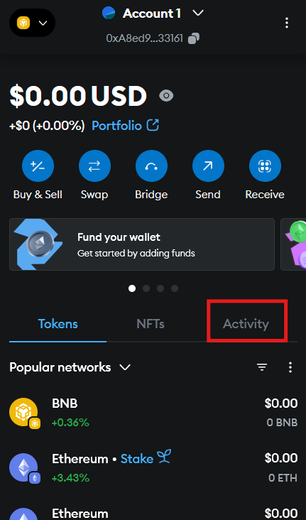
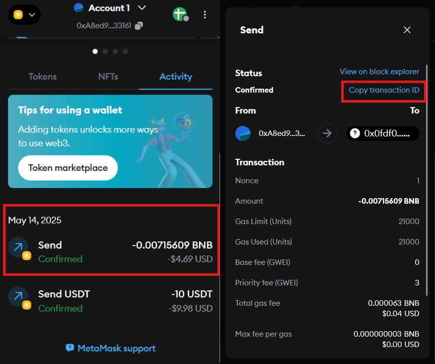
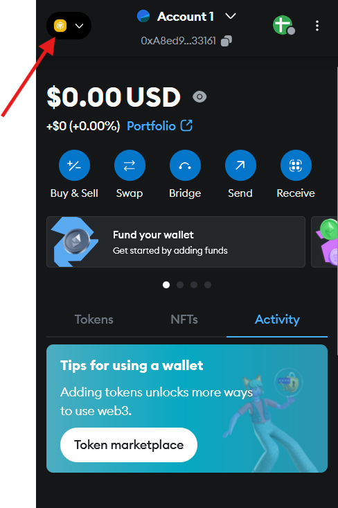
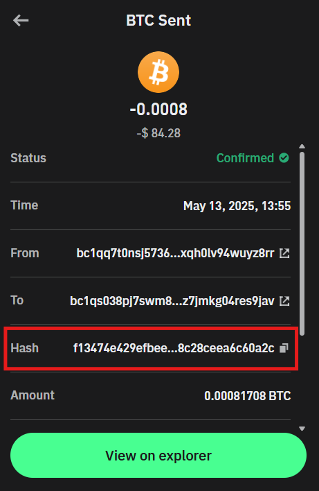
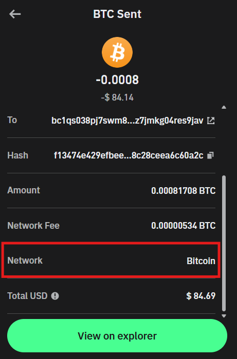
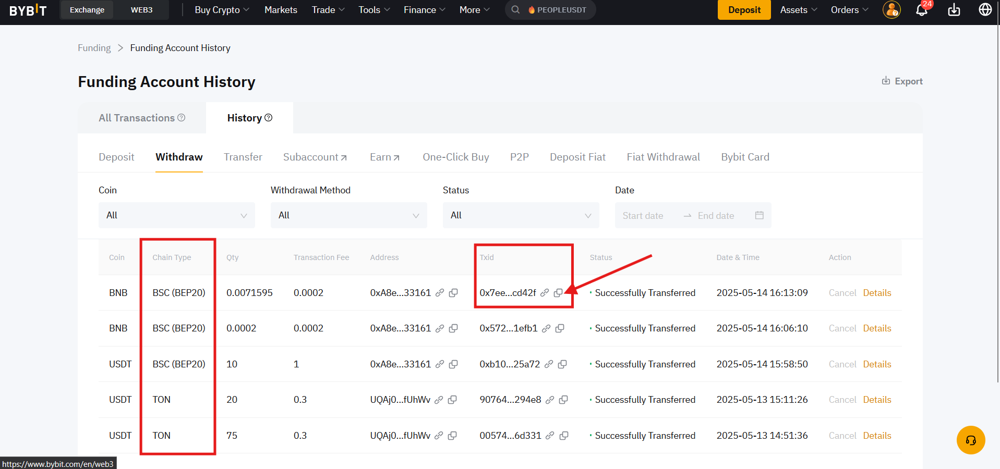

# 🚀 Как найти HASH транзакции и какие бывают сети криптовалют?

Вы отправили криптовалюту, и продавец вдруг спрашивает:

> **«Пришлите TxID и укажите сеть перевода!» 🤔**

Не волнуйтесь, сейчас подробно разберём что это за «сеть», почему это важно и как быстро найти транзакцию в любом блокчейне!

***

### 📌 Что такое сеть криптовалюты?

Сеть криптовалюты (блокчейн) это децентрализованная база данных, в которой записываются все транзакции определённой криптовалюты. У каждой криптовалюты своя сеть, поэтому важно указывать правильную сеть при переводе средств.

***

### 🔍 Почему это важно?

Если отправите криптовалюту не в той сети, средства могут потеряться или задержаться. Поэтому всегда внимательно проверяйте сеть перед отправкой!

***

### 📌 Примеры популярных сетей и криптовалют

Вот самые популярные сети и криптовалюты, которые они поддерживают:

* 🟠 **Bitcoin**: Bitcoin (BTC)
* 🔷 **Ethereum**: Ethereum (ETH), USDT ERC-20, USDC ERC-20 и другие токены ERC-20
* 💎 **Binance Smart Chain (BSC)**: BNB, USDT BEP-20, CAKE и другие токены BEP-20
* ⚡ **Solana**: Solana (SOL), USDC, NFT и другие токены SPL
* 🌀 **Polygon**: MATIC, USDT, USDC и другие токены
* 💸 **XRP Ledger**: Ripple (XRP)
* 🧠 **Cardano**: Cardano (ADA)
* 🐶 **Dogecoin**: Dogecoin (DOGE)
* 🪙 **TRON**: TRON (TRX), USDT TRC-20
* 🧱 **TON**: Toncoin (TON)

***

### 📌 Что такое блокчейн-эксплорер (сканер транзакций)?

🕵️‍♂️ **Блокчейн-эксплорер** это сайт, который позволяет просматривать и отслеживать транзакции любой криптовалюты в реальном времени.

У каждой сети свой эксплорер, поэтому искать перевод нужно в эксплорере той сети, в которой вы его отправили.

Используя **TxID** (в блокчейн-эксплорере), вы можете проверить:

* 📬 Адрес отправителя и получателя
* 💰 Сумму и комиссию
* ✅ Статус транзакции
* 🗓️ Дату и время отправки

***

### 📌 Как узнать сеть отправки и найти TxID?

Вот кратко, как это сделать в популярных сервисах:

### 1️⃣ MetaMask 🦊

* Откройте MetaMask → «Активность».

<figure><figcaption></figcaption></figure>

* Кликните на транзакцию → «Скопировать ID транзакции».

<figure><figcaption></figcaption></figure>

* Текущая сеть указана в MetaMask сверху.

<figure><figcaption></figcaption></figure>

### 2️⃣ Trust Wallet 📱

* Откройте Trust Wallet → выберите историю.

<figure><figcaption></figcaption></figure>

* Нажмите на транзакцию.

<figure><figcaption></figcaption></figure>

* Скопируйте hash транзакции.

<figure><figcaption></figcaption></figure>

* Название сети отображается в самом конце.

<figure><figcaption></figcaption></figure>

### 3️⃣ Биржи (Binance, Bybit, OKX и др.) 💱

* Войдите в раздел «История транзакций» или «Вывод средств».

<figure><figcaption></figcaption></figure>

* Откройте транзакцию и найдите TxID и сеть, указанную для вывода.

<figure><figcaption></figcaption></figure>

***

### 📌 Популярные блокчейн-эксплореры для разных сетей

У каждой сети свой эксплорер. Открывайте тот, который соответствует сети перевода.

#### 🟠 Bitcoin (BTC)

* [Blockchain.com](https://www.blockchain.com/explorer)
* [Blockstream.info](https://blockstream.info/)
* [BTC.com](https://btc.com/)
* [Blockchair](https://blockchair.com/bitcoin)

#### 🔷 Ethereum (ETH)

* [Etherscan.io](https://etherscan.io/)
* [Ethplorer.io](https://ethplorer.io/)
* [Blockchair.com](https://blockchair.com/ethereum)

#### 💎 Binance Smart Chain (BSC)

* [BscScan.com](https://bscscan.com/)
* [Ankrscan.io](https://ankrscan.io/)

#### ⚡ Solana (SOL)

* [Solscan.io](https://solscan.io/)
* [Explorer.solana.com](https://explorer.solana.com/)

#### 🌀 Polygon (MATIC)

* [Polygonscan.com](https://polygonscan.com/)

#### 💸 XRP Ledger (XRP)

* [XRPScan.com](https://xrpscan.com/)
* [Bithomp.com](https://bithomp.com/)

#### 🧠 Cardano (ADA)

* [CardanoScan.io](https://cardanoscan.io/)
* [AdaScan.net](https://adascan.net/)

#### 🐶 Dogecoin (DOGE)

* [Blockchair.com](https://blockchair.com/dogecoin)
* [BlockCypher.com](https://live.blockcypher.com/doge/)

#### 🪙 TRON (TRX)

* [Tronscan.org](https://tronscan.org/)
* [TronGrid.io](https://trongrid.io/)

#### 🧱 TON (Toncoin)

* [TONscan.org](https://tonscan.org/)
* [TON.live](https://ton.live/)

***

### 📌 Пример проверки транзакции в блокчейн-эксплорере

👉 Вставьте TxID (например):\
`0xb4bc263278d3f77a652a8d73a6bfd8ec0ba1a63923bbb4f38147fb8a943da26d`\
на [Etherscan.io](https://etherscan.io/) и получите подробную информацию.

<figure><figcaption></figcaption></figure>

* 📤 Адрес отправителя
* 📥 Адрес получателя
* 💰 Сумму в ETH
* ✅ Статус подтверждения
* ⛽ Размер комиссии (газ)
* 🗓️ Дату и время транзакции

***

### 📝 Итоговые советы:

✅ Всегда проверяйте сеть перед отправкой криптовалюты.

✅ Используйте надёжные блокчейн-эксплореры.

✅ Храните TxID важных транзакций на случай спорных вопросов.

Теперь вы легко сможете разобраться с любой сетью и отследить транзакцию по TxID! 🎉

***

### 📱 Мы на связи

* [Telegram-канал ](https://t.me/GonzoProxy)
* [Telegram-чат ](https://t.me/GonzoProxy_Chat)
* [Instagram](https://www.instagram.com/gonzoproxy)
* [Поддержка 24/7 ](https://t.me/GonzoProxy_bot)

💬 Наша команда на связи. Напишите нам, если что-то не получается.
