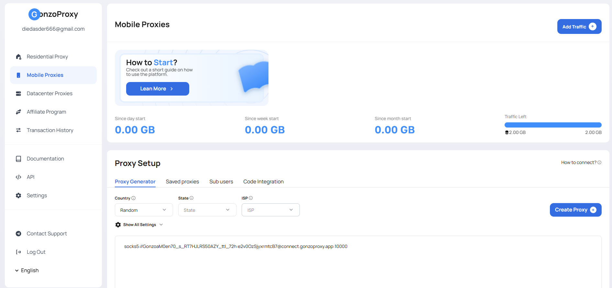

# 📱 Мобильные прокси GonzoProxy

### 📲 Что такое мобильные прокси?

<figure><figcaption></figcaption></figure>

Мобильные прокси — это IP-адреса реальных абонентов сотовых операторов по всему миру. Каждый такой адрес выдаётся оператором связи живому пользователю с SIM-картой, а значит несёт полноценную репутацию мобильного подключения.

Сайты и сервисы физически не могут отличить запрос через мобильный прокси от обычного человека, который листает ленту с телефона в метро. Именно поэтому мобильные IP получают наивысший уровень доверия среди всех типов прокси.

***

### ⚙️ Технология и особенности сети

**Принцип работы:**

* IP-адреса выделяются напрямую операторами сотовой связи через их сети (3G/4G/5G)
* Один IP оператора обычно используется через NAT сразу тысячами реальных абонентов, поэтому блокировка по IP задевает живых пользователей, а операторы и антифрод-системы это учитывают
* Мы подключаемся к легальным точкам обмена трафиком операторов, вы получаете подлинный мобильный адрес, а не его имитацию

**Почему мобильные IP считаются самыми чистыми:**

* Оператор регулярно меняет IP между реальными абонентами, поэтому адрес имеет живую историю использования
* Отсутствуют признаки дата-центра или серверной инфраструктуры
* Сайты видят стандартное поведение мобильного трафика, а не паттерн бота

***

### 🌍 Параметры сети

* Пул из 5+ млн IP-адресов
* Покрытие более 100 стран
* Таргетинг по стране, региону и оператору
* Максимальное доверие сайтов и самая низкая частота блокировок среди всех типов прокси
* Скорость ниже, чем у резидентских и серверных прокси, из-за особенностей мобильных сетей
* Неограниченное количество одновременных сессий

***

### ✅ Мобильные прокси помогают

* Заводить и прогревать аккаунты в соцсетях без блокировок
* Работать с сервисами, которые агрессивно банят резидентские и серверные IP
* Обходить лимиты по количеству регистраций с одного адреса
* Тестировать мобильные приложения и рекламу в реальных условиях
* Работать с финансовыми и криптосервисами, где важен максимальный уровень доверия

***

### 🔁 Ротация&#x20;

Два режима работают одинаково для резидентских, мобильных и серверных прокси:

* **На каждый запрос** — новый IP выдаётся при каждом обращении
* **Sticky-сессия** — IP закрепляется на заданный срок, до 72 часов

В sticky-режиме IP меняется при истечении срока сессии, при пересоздании сессии, либо при выходе узла из сети (актуально для резидентских и мобильных прокси, где IP привязан к реальному устройству).

***

### 🧠 Экспертные советы

**Когда выбирать мобильные, а не резидентские:** Если сервис особенно жёстко банит по IP или вы уже столкнулись с блокировками на резидентских адресах, мобильные прокси дают дополнительный запас прочности за счёт NAT-эффекта оператора.

**Особенности ротации:** Из-за общей природы мобильных сетей IP может смениться раньше, чем истечёт заданное время sticky-сессии, это нормальное поведение оператора, а не сбой на нашей стороне.

**Скорость и задачи:** Для задач, где важна скорость (массовый парсинг, быстрый чекаут), лучше подходят серверные или резидентские прокси. Мобильные оптимальны там, где на первом месте доверие сайта, а не скорость.

***

#### 🛠️ Технические особенности 

* При отключении устройства-донора, система **автоматически подберёт аналогичный IP** на основе заданных параметров
* Создание **неограниченного количества прокси** — вы платите **только за использованный трафик**
* **Полная совместимость** со всеми популярными инструментами, парсерами и платформами
* **Поддержка 24/7** в Telegram: [@gonzoproxy\_bot](https://t.me/gonzoproxy_bot) — ответ в течение нескольких минут

***

#### 🚀 Начните сегодня 

Используйте преимущества резидентских прокси **GonzoProxy** и **забудьте о блокировках, антифроде и ограничениях**.

***

#### 👾 Попробовать можно здесь: [GonzoProxy.com](https://gonzoproxy.com)​ 

***

#### 📱 Мы на связи 

* ​[Telegram-канал ](https://t.me/GonzoProxy)​
* ​[Telegram-чат ](https://t.me/GonzoProxy_Chat)​
* ​[Instagram](https://www.instagram.com/gonzoproxy)​
* ​[Поддержка 24/7 ](https://t.me/GonzoProxy_bot)​

💬 Наша команда всегда на связи! Обращайтесь в любое время суток — решим любой вопрос в течение нескольких минут.
