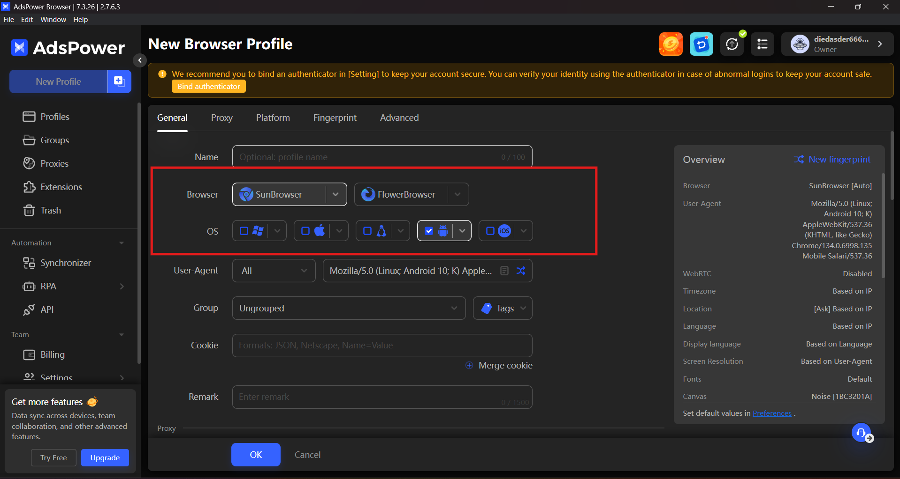
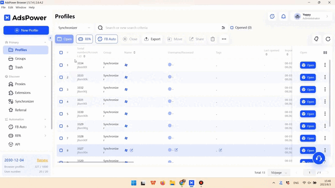

# 🔍 Настройка AdsPower

AdsPower это антидетект-браузер, который держит каждый аккаунт в отдельном профиле браузера, а прокси задаёт профилю отдельный IP-адрес. Ниже показано, куда вставить строку подключения GonzoProxy.

***

### 🧠 **Возможности AdsPower**

Кроме менеджера профилей в **AdsPower** есть несколько инструментов, которые пригодятся в повседневной работе. Ниже разбираем, что делает каждый из них.

***

#### **1. Контроль браузерных отпечатков** 🧬

Отпечаток настраивается не только на уровне заголовков и *user-agent*: задаются параметры всего устройства.

<figure><figcaption></figcaption></figure>

**Что настраивается:**

* Отпечатки не только десктопных ОС, но и мобильных, *Android* и *iOS*.
* Работа на движке *Chromium* или *Firefox*, на выбор.
* Технические характеристики: видеокарта, WebGL, WebRTC, язык системы, шрифты, шум устройства, разрешение экрана и прочее. Каждый параметр можно выставить вручную.

***

#### **2. Автоматизация без кода** ⚙️

В **AdsPower** встроена система автоматизации на базе **RPA (Robotic Process Automation)**. Действия внутри браузера настраиваются без написания скриптов.

<figure><figcaption></figcaption></figure>

**Что умеет автоматизация:**

* Запуск сценариев без написания скриптов
* Клики, переходы по страницам, ввод текста
* Логин и логаут, работа с мультиаккаунтами
* Готовые шаблоны, чтобы не собирать сценарий с нуля

Логика задаётся визуально, шаг за шагом.

📎 Подробнее про RPA → [https://www.adspower.net/blog/post/rpa-function](https://www.adspower.net/blog/post/rpa-function)

***

#### **3. Синхронизатор** 🧩

Синхронизатор повторяет одно и то же действие сразу в нескольких браузерных профилях, без скриптов и дополнительных плагинов.

<figure><figcaption></figcaption></figure>

**Что можно синхронизировать:**

* Переходы по ссылкам
* Ввод текста
* Заполнение форм
* Клики по кнопкам
* Установку расширений

<figure><figcaption></figcaption></figure>

Ты работаешь в основном окне, а действие повторяется во всех подключённых профилях. Удобно, когда одну и ту же задачу нужно выполнить в наборе аккаунтов.

📎 Подробнее о Синхронизаторе → [https://www.adspower.net/blog/post/Synchronizer](https://www.adspower.net/blog/post/Synchronizer)

***

#### **4. Работа в команде** 👥

В браузере есть система управления доступом и действиями сотрудников.

<figure><figcaption></figcaption></figure>

**Что есть:**

* **Многоуровневая система прав.** Ты сам решаешь, кто может видеть и редактировать конкретные профили.
* **Журнал активности.** Видно, кто, когда и что сделал.
* **Распределение задач** между сотрудниками.

Подходит, когда с одним набором профилей работают несколько человек.

***

### 💻 **Как скачать и установить AdsPower**

Чтобы начать работать с **AdsPower**, нужно выполнить несколько простых шагов:

1. Перейдите на официальный сайт [AdsPower](https://www.adspower.com/) и нажмите кнопку «Скачать».

<figure><figcaption></figcaption></figure>

2. Выберите установочный файл для вашей операционной системы (Windows или Mac).

<figure><figcaption></figcaption></figure>

3. После того как файл скачан, откройте его и следуйте инструкциям на экране. Для пользователей macOS может потребоваться разрешение на установку.

***

### 📝 **Как начать использовать AdsPower**

1. После установки откройте браузер и нажмите на кнопку «Регистрация».

<figure><figcaption></figcaption></figure>

2. Заполните форму: email, пароль, код подтверждения, и нажмите «Зарегистрироваться».

<figure><figcaption></figcaption></figure>

3. Можно зарегистрироваться через социальные сети, такие как Google, Facebook или VK.

После регистрации вы попадете в личный кабинет, где сможете создавать и настраивать свои профили.

***

### 🔧 **Как настроить браузер AdsPower**

Настройка в **AdsPower** делится на четыре ключевые части: **профиль, прокси, отпечатки и куки**. Ниже разбираем всё по шагам.

***

#### **1. Настройка профиля**

Каждый профиль хранит своё окружение браузера и свой прокси.

<figure><figcaption></figcaption></figure>

**Что делаем:**

* Жмём в левом верхнем углу кнопку «Новый профиль».
* Имя профиля: пиши, как тебе удобно. Например: `fb_akk_men_1` или `shop_avito_test2`.
* Браузер: выбирай Chrome или Firefox.
* Система: MacOS или Windows.
* User-Agent: лучше не трогай.
* Группа: чтобы потом не искать в куче.
* Cookies: пока пропускаем.
* Заметки: можно оставить комментарий, например: *“под фарм”*.

<figure><figcaption></figcaption></figure>

***

#### **2. Добавляем прокси**

Прокси задаёт профилю отдельный IP-адрес. Допустим, ты купил резидентские прокси **США** от [**GonzoProxy**](https://gonzoproxy.com/?utm_source=gitbook\&utm_medium=anti-detekt-brauzer-adspower) и получил строку: `Gonzoj9CiIi_c_US_sd_443_s_663698TEC_ttl_72h:RNW78Fm5@connect.gonzoproxy.app:10000`

<figure><figcaption></figcaption></figure>

**Разбиваем и вставляем:**

* Тип прокси: SOCKS5 или HTTPS
* IP (хост): `connect.gonzoproxy.app`
* Порт: `10000`
* Логин: `Gonzoj9CiIi_c_US_sd_443_s_663698TEC_ttl_72h`
* Пароль: `RNW78Fm5`

<figure><figcaption></figcaption></figure>

***

#### ✅ **3. Нажимаем “Проверить прокси”**

Если всё ввёл правильно, загорится **зелёная галка**:

* Прокси отвечает
* IP живой
* Профиль можно сохранять

<figure><figcaption></figcaption></figure>

Если галки нет, проверь внимательно: может быть лишний пробел, не тот порт или ошибка в логине.

***

#### **4. Настройка отпечатков**

Заполняем поля отпечатка в профиле:

* **WebRTC** → _Отключить_
* **Часовой пояс** → _На основе IP_
* **Геолокация** → _На основе IP_
* **Язык** → _На основе IP_
* **Язык приложения** → _На основе IP_
* **Разрешение экрана** → _Предопределенные_
* **Шрифты** → _По умолчанию_
* **Шум оборудования** → _Всё включить_
* **Метаданные WebGL** → _Настроить вручную_
* **WebGPU** → _На основе WebGL_

<figure><figcaption></figcaption></figure>

Готово. Профиль настроен.

<figure><figcaption></figcaption></figure>

***

### 📱 Мы на связи

* [Telegram-канал ](https://t.me/GonzoProxy)
* [Telegram-чат ](https://t.me/GonzoProxy_Chat)
* [Instagram](https://www.instagram.com/gonzoproxy)
* [Поддержка 24/7 ](https://t.me/GonzoProxy_bot)

💬 Наша команда всегда на связи! Обращайтесь в любое время суток.
