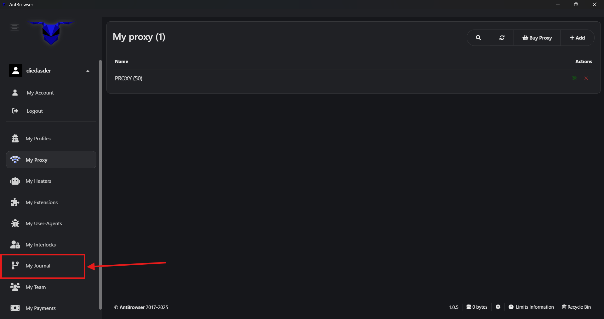

# 🕵️ Настройка AntBrowser

Если вы работаете с **мультиаккаунтами**, **арбитражем** или **SMM**, то знаете, что **антидетект браузер** это не роскошь, а необходимость.

**AntBrowser** это антидетект браузер, позволяющий создавать и управлять множеством **профилей**, каждый из которых имитирует **отдельное устройство** с **уникальными параметрами**.

***

### 🎯 Особенности антидетект браузера AntBrowser

#### 1. Прогреватор


<figure><figcaption></figcaption></figure>


Функция **«Прогреватор»** в AntBrowser автоматически посещает заданные сайты в течение заданного времени.

**Как работает:**

* Перейдите в раздел **Прогреватор**

* Создайте шаблон: например, `WarmUp_basic_set_1`

  1. **Название шаблона**
  2. **Диапазон времени нахождения на сайте**: например, от 60 до 180 секунд
  3. **Список URL**: например:

* [https://www.bbc.com](https://www.bbc.com/)
* [https://www.reddit.com](https://www.reddit.com/)
* [https://www.imdb.com](https://www.imdb.com/)
* [https://www.quora.com](https://www.quora.com/)
* [https://www.wikipedia.org](https://www.wikipedia.org/)
* [https://www.nationalgeographic.com](https://www.nationalgeographic.com/)
* [https://www.medium.com](https://www.medium.com/)
* [https://www.amazon.com](https://www.amazon.com/)
* [https://www.booking.com](https://www.booking.com/)
* [https://www.deezer.com](https://www.deezer.com/)

AntBrowser будет автоматически заходить на эти сайты по заданному шаблону.

***

#### 2. Блокиратор


<figure><figcaption></figcaption></figure>


**«Блокиратор»** в AntBrowser позволяет **отключать нежелательные скрипты** и **отслеживающие элементы** на сайтах.

***

#### 3. Журнал


<figure><figcaption></figcaption></figure>


Больше никаких:

* «Ой, случайно удалили»
* «Куда пропали куки»
* «Кто очистил браузер»

В **AntBrowser** есть функция **отката профиля по контрольным точкам**, **Time Machine**.

Если вы или ваш сотрудник:

* случайно **очистили данные**
* сохранили **пустой профиль в облако**
* сделали **неудачную правку**

Это **не конец**.

Вы можете вернуться к **конкретному моменту времени** и **восстановить профиль**:\
**куки**, **историю входов**, **локальное хранилище** и другие параметры.

***

#### 4. Командная работа


<figure><figcaption></figcaption></figure>


**AntBrowser** предоставляет возможности для **эффективной командной работы**:

* **Роли и права доступа**: создавайте **роли** с различными уровнями доступа
* **Общий доступ к профилям**: делитесь **профилями** без необходимости передачи паролей
* **Синхронизация данных**: обеспечьте **синхронизацию куки**, истории и других данных между участниками команды

***

### 🌍 Добавляем 50 прокси от **GonzoProxy**

У каждого профиля свой IP. Прокси создаются в **GonzoProxy**.


<figure><figcaption></figcaption></figure>


**Как загрузить 50 прокси:**

1. Перейдите в раздел **Прокси → Добавить**
2.  Вставьте список в формате:

    ```
    логин:пароль@IP:порт|socks5
    ```

    **Пример:**

   ```
   Gonzoj9CiIi_c_US_sd_898_city_Orlando_s_970852HFO_ttl_72h:RNW78Fm5@connect.gonzoproxy.app:10000|socks5
   ```
3. Нажмите **Добавить**, и прокси **автоматически сохранятся** в списке.


<figure><figcaption></figcaption></figure>


***

### 📱 Настройка профиля: от экрана до микрофона

**AntBrowser** позволяет настроить **абсолютно всё**, от **цвета профиля** до **медиапортов**.

| Настройка              | Что указать                                      |
| ---------------------- | ------------------------------------------------ |
| Прокси                 | Выберите добавленный из списка                   |
| Язык и часовой пояс    | Автоматически, по IP                             |
| Метки                  | Статус, цвет, заметка, для навигации             |
| User-Agent             | Авто (или вручную Android/iOS/Windows/macOS)     |
| Разрешение экрана      | 360x640 (моб.) / 1366x768 (десктоп)              |
| Canvas / WebGL / Аудио | Подмена, для защиты от фингерпринта              |
| WebRTC                 | Автоматически / Отключено, при мобильных прокси  |
| Геолокация             | Автоматически                                    |
| Процессор              | 2-4 ядра (моб.) / 4-8 (десктоп)                  |
| ОЗУ                    | 4-8 Gb (моб.) / 8-32 Gb (десктоп)                |
| Медиа устройства       | Микрофон: 1 / Аудио: 1 / Вебкамера: 1            |
| Прогреватор            | Выберите готовый шаблон                          |
| Блокиратор             | Выберите заранее созданный фильтр                |
| Автозаполнение         | Выберите нужные сервисы (VK, OLX, Avito и др.)   |
| Расширения             | Установите нужные расширения                     |

***

### 👾 Попробовать можно здесь: [GonzoProxy.com](https://gonzoproxy.com)

***

### 📱 Мы на связи

* [Telegram-канал ](https://t.me/GonzoProxy)
* [Telegram-чат ](https://t.me/GonzoProxy_Chat)
* [Instagram](https://www.instagram.com/gonzoproxy)
* [Поддержка 24/7 ](https://t.me/GonzoProxy_bot)

💬 Наша команда всегда на связи! Обращайтесь в любое время суток.
