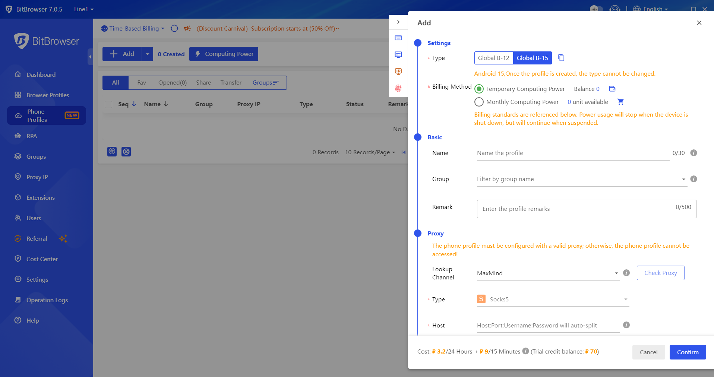
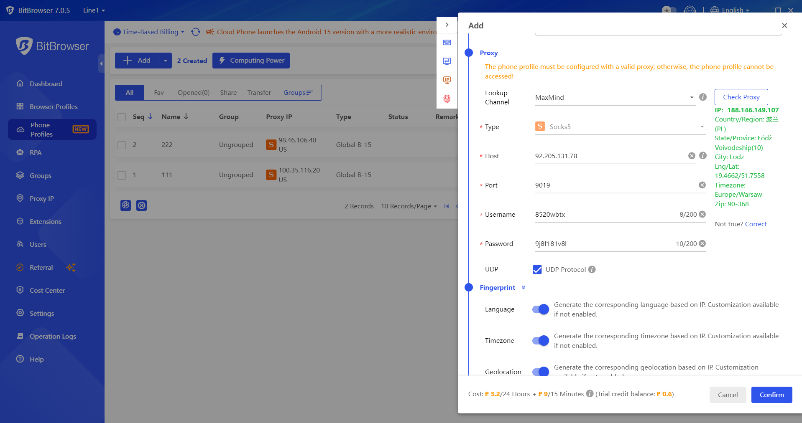
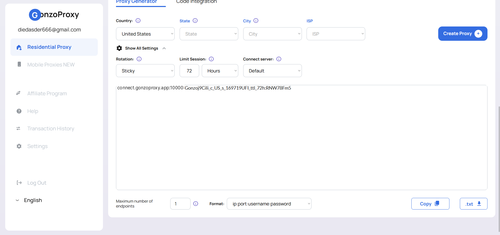
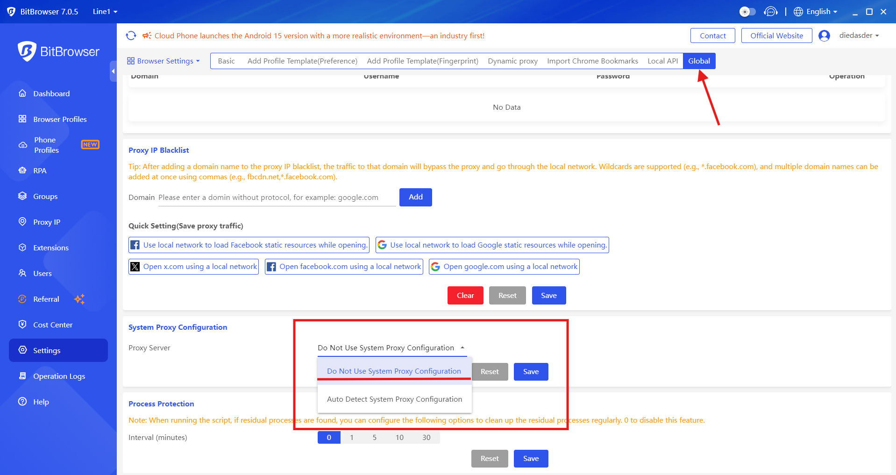

# 🚀 Настройка BitBrowser

Если вы работаете с **множеством аккаунтов** или автоматизируете работу браузера, антидетект-браузер будет одним из рабочих инструментов. На этой странице разбираем [**BitBrowser**](https://www.bitbrowser.net/ru/): куда вставить в его профиле строку подключения из личного кабинета [**GonzoProxy**](https://gonzoproxy.com/?utm_source=gitbook\&utm_medium=bitbrowser\&utm_content=ru).

BitBrowser позволяет создавать отдельные браузерные профили со своими настройками *отпечатков*, эмулируя разные устройства и окружения.

***

## 📌 **Особенности BitBrowser**

### 👥 **Работа в команде**

BitBrowser хорошо подходит для **командной работы**. Каждый сотрудник использует отдельный профиль с уникальными отпечатками, а сессии изолированы друг от друга. Передавать профили можно с помощью встроенного механизма экспорта/импорта. Это облегчает запуск новых рабочих мест или передачу профилей между участниками проекта.&#x20;

<figure><figcaption></figcaption></figure>

Есть централизованное управление сценариями и профилями, а также гибкая система прав доступа 🔐, можно чётко определить, кто и какие действия имеет право выполнять.

***

### ⚙️ **API**

Взаимодействие с **API** позволяет интегрировать BitBrowser с внешними системами и автоматизировать ключевые процессы. Через локальный API можно управлять приложением: открывать браузер, настраивать прокси, создавать и запускать профили, а также выполнять другие операции. Это помогает реализовать автоматизированные сценарии без участия пользователя.

<figure><figcaption></figcaption></figure>

Использование API открывает возможности для построения скриптов и интеграций с внешними платформами.

> Полная документация доступна по [ссылке](https://doc.bitbrowser.net/api-docs/introduction).

***

### 🧩 **Расширения**

Если встроенных возможностей недостаточно, функционал BitBrowser легко расширяется.&#x20;

<figure><figcaption></figcaption></figure>

В Центре расширений доступна установка готовых решений, а также поддерживается разработка собственных модулей. Это удобно для интеграции с внешними системами, автоматического решения капч или модификации поведения браузера.

> Полная документация доступна по [ссылке](https://doc.bitbrowser.net/help1/extensions).

***

### **🤖 RPA: автоматизация без программирования**

Для автоматизации рутинных действий BitBrowser оснащён инструментом **RPA**. Он позволяет записывать последовательность действий в браузере (_заполнение форм, переходы по страницам, ввод данных и т.п._), а затем воспроизводить её в нужных профилях.

<figure><figcaption></figcaption></figure>

Интеграция с профилями даёт возможность запускать автоматизацию в нужном окружении, с заданными отпечатками и сетевыми параметрами. Это упрощает массовую работу и помогает снизить количество ошибок при повторяющихся задачах.

> Полная документация доступна по [ссылке](https://doc.bitbrowser.net/rpa/rpa-usage-guide).

***

### 📋 **Логи операций**

В процессе работы браузер ведёт подробные _логи_. В них фиксируются посещённые страницы, взаимодействие с элементами, отправленные запросы и действия автоматизации.

<figure><figcaption></figcaption></figure>

Логи позволяют удобно **отслеживать работу команды, контролировать активность по профилям и при необходимости восстанавливать профили или их состояние.** Это упрощает совместную работу и повышает надёжность процессов.

<figure><figcaption></figcaption></figure>

***

### **📱 Интеграция с Cloud Phone**

BitBrowser интегрируется с **Cloud Phone**, что позволяет использовать виртуальные мобильные устройства. Это актуально при тестировании мобильных версий сайтов, проверке региональных сценариев или работе с аккаунтами, где требуются реальные мобильные устройства.

<figure><figcaption></figcaption></figure>

***

### 🔧 **Настройка мобильного профиля с мобильными прокси GonzoProxy**

#### Шаг 1: Подготовка прокси

Выберите нужную страну и тип прокси  в разделе мобильных прокси от [**GonzoProxy**](https://gonzoproxy.com/?utm_source=gitbook\&utm_medium=bitbrowser\&utm_content=ru).&#x20;

<figure><figcaption></figcaption></figure>

Скопируйте данные:

* **IP**: `92.205.131.78`
* **Порт**: `9019`
* **Логин**: `8520wbtx`
* **Пароль**: `9j8f181v8l`

<figure><figcaption></figcaption></figure>

#### Шаг 2: Создание мобильного профиля в BitBrowser

* В разделе создания нового профиля выберите тип устройства: *мобильный*.
* Настройте вычислительную мощность: зарубежные **B-15**.
* Выберите метод выставления счетов: временные вычислительные мощности или ежемесячные вычислительные мощности.

**В базовых настройках** укажите:

* Название окружения, группу, при необходимости: заметки.
* Введите данные прокси от GonzoProxy (_IP, порт, логин, пароль_) и нажмите **Check proxy**.
* Включите тумблер **UDP**.

<figure><figcaption></figcaption></figure>

✅ **Проверка прокси пройдена**.

**В настройках отпечатков** включите тумблеры: язык, часовой пояс, локация.

Теперь профиль готов к работе с использованием реального мобильного прокси.

***

### 🔄 **Синхронизатор Cloud Phone**

С помощью синхронизатора можно управлять сразу несколькими виртуальными устройствами Cloud Phone, синхронизируя их с одним основным профилем. Все действия, управление мышью, ввод с клавиатуры, запуск приложений, автоматически повторяются на всех подключённых средах.

<figure><figcaption></figcaption></figure>

Поддерживается:

* синхронный ввод текста (_одинаковый или разный_);
* массовая установка и удаление приложений;
* пакетная загрузка файлов и перезапуск окружений.

👉 _Для использования синхронизатора необходимо открыть не менее двух окружений с одинаковым типом мощности и моделью оплаты._

> Полная документация доступна по [ссылке](https://doc.bitbrowser.net/cloud-phone/synchronizer/graphic).

***

### 🛠️ **Как правильно настроить браузерный профиль с резидентскими прокси GonzoProxy**

| Параметр                                  | Описание                                                                                          |
| ----------------------------------------- | ------------------------------------------------------------------------------------------------- |
| **Название профиля**                      | Укажите название профиля                                                                          |
| **Группа**                                | Назначьте группу для удобства организации профилей                                                |
| **Платформа для входа**                   | Укажите платформу, на которую хотите сразу войти (например: Facebook, Twitter, TikTok, Instagram) |
| **Логин и пароль аккаунта**               | Введите учётные данные для автоматического входа                                                  |
| **Отключение проверки дубликатов**        | Выключите настройку, чтобы отключить проверку дублирующихся профилей                              |
| **Разрешение многозадачности**            | Активируйте для возможности одновременной работы с профилем у нескольких учетных записей          |
| **Ключ 2FA (если имеется)**               | Вставьте ключ двухфакторной аутентификации для автоматизированного входа                          |
| **Заметки или Cookie**                    | Добавьте заметки или импортируйте Cookie для сохранения сеанса                                    |
| **Сайт для открытия при запуске профиля** | Укажите URL сайта, который откроется при запуске браузера                                         |

#### **Настройка прокси от GonzoProxy**

Получаем **резидентские прокси** в личном кабинете [**GonzoProxy**](https://gonzoproxy.com/?utm_source=gitbook\&utm_medium=bitbrowser\&utm_content=ru)

<figure><figcaption></figcaption></figure>

В BitBrowser выставляем:

* метод: вручную,&#x20;
* тип: **Socks5**,&#x20;
* IP: IPv4,&#x20;
* вводим данные (_хост, порт, логин, пароль_).
* Жмем Check Proxy

<figure><figcaption></figcaption></figure>

✅ **Проверка прокси пройдена**.

_Если при проверки прокси выдает ошибку, то переключите в настройках на "Не использовать настройку системного прокси"._

<figure><figcaption></figcaption></figure>

#### **Дополнительно**

* главная страница: локальная, загрузка изображений, включена, синхронизация вкладок, Cookie и паролей, аппаратное ускорение.

Остальные параметры можно оставить выключенными по умолчанию.

#### **Тонкая настройка отпечатков**

| Параметр                         | Значение / Рекомендация      |
| -------------------------------- | ---------------------------- |
| **Браузер**                      | BitBrowser                   |
| **Ядро**                         | Не менять (например, 134)    |
| **Устройство**                   | PC / Android / iPhone        |
| **Операционная система (ОС)**    | Windows 11 (или ваша версия) |
| **User Agent**                   | Не менять                    |
| **Язык и часовой пояс**          | Включить                     |
| **WebRTC**                       | Подменять                    |
| **Локация**                      | Автоматическая по IP         |
| **Размер окна**                  | 1280x720                     |
| **Шрифты, Canvas, WebGL и т.п.** | Настроить случайно           |
| **Защита от порт-сканирования**  | Включена                     |
| **Остальные опции**              | Можно оставить выключенными  |

***

Используйте [**BitBrowser**](https://www.bitbrowser.net/ru/) вместе с [**GonzoProxy**](https://gonzoproxy.com/?utm_source=gitbook\&utm_medium=bitbrowser\&utm_content=ru): строка подключения из личного кабинета вставляется в поля прокси у профиля, и профиль работает через неё.

***

### 👾 Попробовать можно здесь: [GonzoProxy.com](https://gonzoproxy.com/?utm_source=gitbook\&utm_medium=bitbrowser\&utm_content=ru)

***

### 📱 Мы на связи

* [Telegram-канал ](https://t.me/GonzoProxy)
* [Telegram-чат ](https://t.me/GonzoProxy_Chat)
* [Instagram](https://www.instagram.com/gonzoproxy)
* [Поддержка 24/7 ](https://t.me/GonzoProxy_bot)

💬 Наша команда всегда на связи! Обращайтесь в любое время суток.
