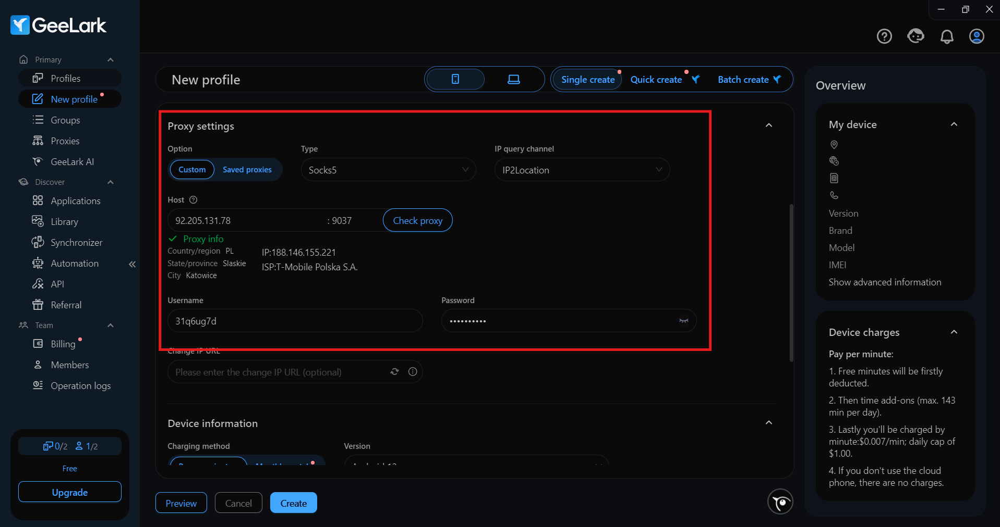
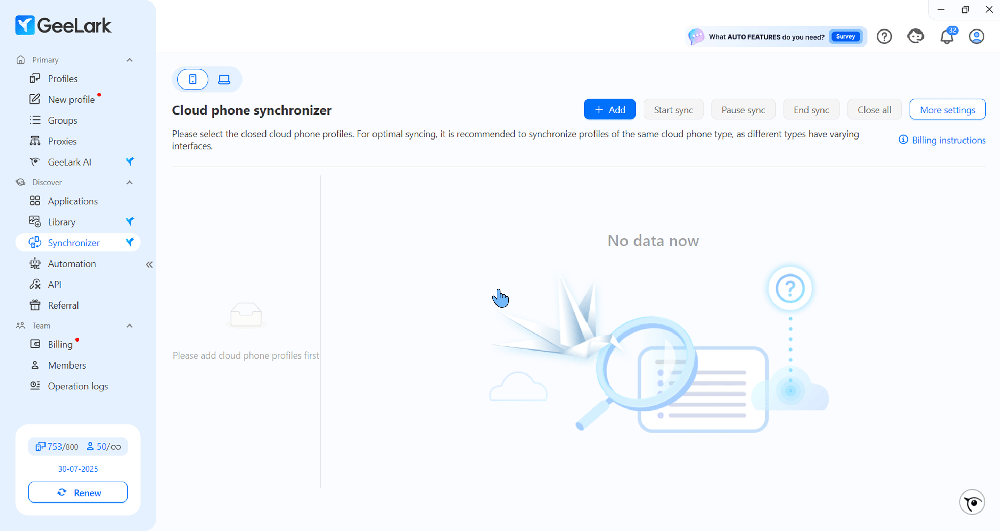
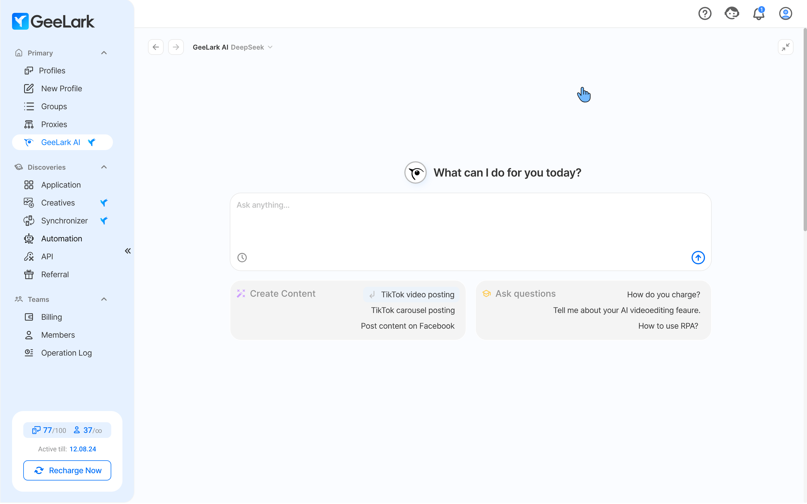

# ⚡️ Настройка GeeLark

Масштаб — это не просто запуск большего числа аккаунтов. Это стабильность, незаметность и точная имитация поведения живого пользователя. Сегодня платформы смотрят глубже браузера: в железо, поведение устройства, сеть и окружение. Эмуляторы и антидетекты уже не справляются — слишком шаблонно, слишком заметно.

**GeeLark** — это облачный Android, который выглядит и работает как настоящий смартфон. Ни один браузер-антидетект или эмулятор не даёт такого уровня реализма. Для приложений и платформ это полноценное физическое устройство со всеми техническими характеристиками.

***

### ⚙️ Настройка GeeLark с мобильными прокси от GonzoProxy

#### Шаг 1: Выбери страну и тип прокси в личном кабинете GonzoProxy

<figure><figcaption></figcaption></figure>

Скопируй:

* **IP -** 92.205.131.78
* **Порт -** 9037
* **Логин** - 31q6ug7d
* **Пароль -** usq15\_w5h9

<figure><figcaption></figcaption></figure>

#### Шаг 2: Создай новый профиль в GeeLark

<figure><figcaption></figcaption></figure>

Введи данные прокси, полученные в GonzoProxy и нажми Check proxy:

<figure><figcaption></figcaption></figure>

Прокси работают **отлично** ✅

***

#### Далее настрой параметры устройства под прокси:

<figure><figcaption></figcaption></figure>

* **Операционная система**: Android / iOS
* **Версия ОС**: выбрать нужную или актуальную
* **Местоположение**: определять на основе IP-адреса прокси
* **Бренд устройства**: установить как случайный
* **Модель устройства**: случайный выбор
* **Язык интерфейса**: подбирать автоматически по IP

После сохранения настроек облачное устройство будет адаптировано под прокси, а его параметры — максимально приближены к реальному пользователю из указанного региона. Это даёт ровный цифровой след и снижает риск обнаружения.

***

### 🔥 Дополнительные фишки GeeLark, которые делают работу быстрее

### 🔁 Synchronizer

<figure><figcaption></figcaption></figure>

Одно из выдающихся предложений GeeLark. Она позволяет пользователям управлять несколькими облачными телефонами одновременно. Действия, выполняемые в основном профиле, автоматически реплицируются на все подключенные профили. Это значительно сокращает время, необходимое для выполнения одинаковых задач в нескольких аккаунтах.

📌 _Идеально для прогрева аккаунтов и масштабной активности._

***

### 🤖 Готовые шаблоны автоматизации

<figure><figcaption></figcaption></figure>

GeeLark предлагает готовые шаблоны автоматизации для популярных приложений, таких как **TikTok** и **Facebook**. Эти шаблоны могут автоматизировать:

* Вход в учетную запись и настройка
* Редактирование и настройка профиля
* Размещение и планирование контента
* Действия по вовлечению (лайки, подписки, комментарии)
* Отслеживание аналитики и отчетность
* «Прогрев» аккаунта, чтобы он выглядел естественно

В TikTok Шаблоны автоматизации особенно эффективны, поскольку поддерживают автоматический вход в систему для нескольких учетных записей, массовое редактирование профилей (изменение аватаров, имен пользователей, биографий), планирование видеопубликаций с возможностью пакетного редактирования и имитацию действий человека для естественного разогрева учетных записей.

***

### 🧠 GeeLark AI

<figure><figcaption></figcaption></figure>

В GeeLark теперь доступна помощь ИИ на базе DeepSeek. Эта помощь призвана помочь вам в создании контента и облегчить понимание и использование GeeLark. Кроме того, не стесняйся задавать ИИ GeeLark любые другие вопросы!

***

### 🧑‍🤝‍🧑 Функции для команд и агентств

<figure><figcaption></figcaption></figure>

В GeeLark можно создавать роли с разными уровнями доступа для каждого члена команды и легко делиться профилями с любым участником вашей команды, оптимизируя рабочий процесс.

***

### Почему эта связка работает ❓

**GeeLark** даёт тебе реальное Android-устройство. **GonzoProxy** — реальный мобильный IP.

* Никаких пересечений между аккаунтами
* Никаких палев по гео, языку, IP или поведению
* Никаких костылей и ручного фарма на десятках телефонов

Ты работаешь через браузер — а для платформы это выглядит как обычный пользователь с телефона.\
Только не один, а десятки. И каждый — чистый.

**Вот так выглядит масштаб, который не ломается.**

***

### 👾 Попробовать можно здесь: [GonzoProxy.com](https://gonzoproxy.com)

***

### 📱 Мы на связи

* [Telegram-канал ](https://t.me/GonzoProxy)
* [Telegram-чат ](https://t.me/GonzoProxy_Chat)
* [Instagram](https://www.instagram.com/gonzoproxy)
* [Поддержка 24/7 ](https://t.me/GonzoProxy_bot)

💬 Наша команда всегда на связи! Обращайтесь в любое время суток — решим любой вопрос в течение нескольких минут.
