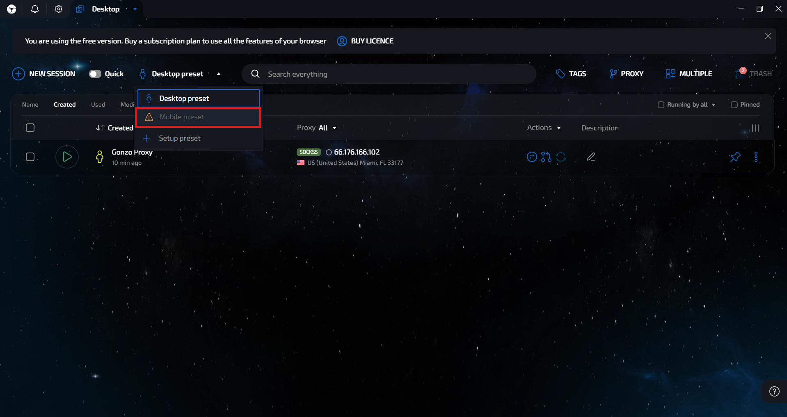
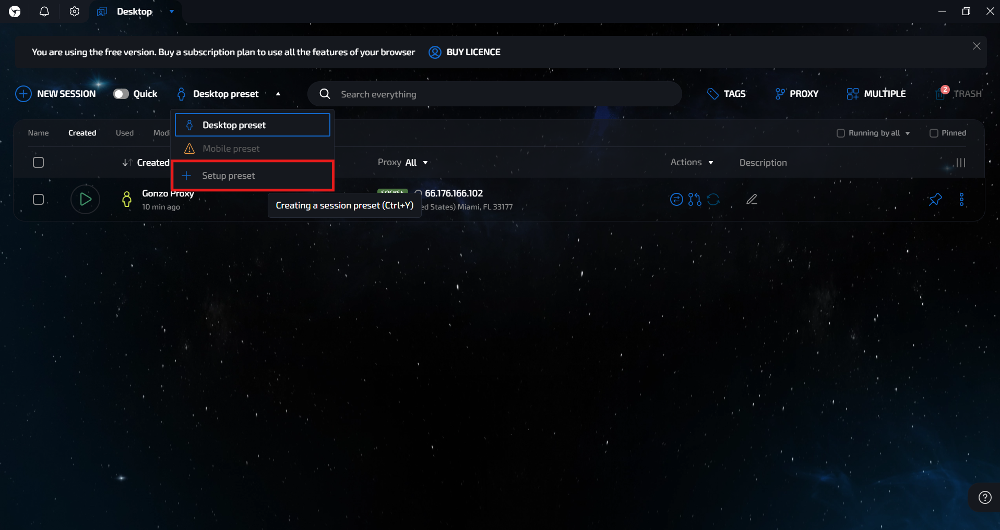

# 🔘 Настройка Linken Sphere 2

Если вы занимаетесь трафиком уже несколько лет, то наверняка слышали о Linken Sphere: это был один из первых антидетект-браузеров на рынке, который позволил комфортно управлять десятками аккаунтов из одного приложения.

Однако долгое время Linken Sphere не получала значительных обновлений и начала уступать более современным конкурентам. Ситуация резко изменилась с выходом Linken Sphere Evolution чуть больше года назад. Разработчики учли основные пожелания клиентов, обновили браузер и снова вернулись на уровень ведущих решений.

Но команда Sphere не остановилась на этом, и на днях был представлен Linken Sphere 2. Это не просто очередное обновление, это полностью переосмысленный браузер, который вобрал в себя всё лучшее из предыдущих версий и учёл пожелания опытных пользователей.

📌 **Важно**: профилю нужен прокси. Резидентские и мобильные прокси для него берутся в личном кабинете [**GonzoProxy**](https://gonzoproxy.com/?utm_source=gitbook\&utm_medium=ru\&utm_content=linkensphere).

***

### ⚙️ Основные преимущества Linken Sphere 2

#### 🤖 Автоматический прогрев аккаунтов

Теперь можно забыть о ручном наборе куков. С новым инструментом «Прогреватор» браузер сам совершает действия, максимально похожие на поведение обычного пользователя, тем самым набивая качественные куки для ваших сессий.

<figure><figcaption></figcaption></figure>

➡️ Для запуска прогрева достаточно выбрать нужный профиль, нажать **«Действия» → «Прогрев»**.

<figure><figcaption></figcaption></figure>

***

#### 👥 Удобная командная работа

Linken Sphere 2 делает работу в команде максимально удобной. Настраивайте роли, права и доступы прямо в интерфейсе браузера. Создание команд теперь занимает пару секунд, просто нажмите на иконку антика в левом верхнем углу экрана.

<figure><figcaption></figcaption></figure>

***

### 🛠️ Дополнительные возможности для удобной работы

#### 📱 Эмуляция мобильных устройств

Linken Sphere 2 позволяет эмулировать мобильные устройства, это достаточно редкая функция даже среди антидетект-браузеров. Чтобы включить этот режим, на главной странице из выпадающего списка выберите **«Mobile Preset»**.

<figure><figcaption></figcaption></figure>

Далее, при создании новой сессии, можно выбрать нужную версию Android или iOS, а также тип мобильного браузера.

***

#### 🖥️ Рабочие столы

Если вы работаете с большим количеством аккаунтов, функция **«Рабочие столы»** поможет структурировать процесс. В Linken Sphere 2 можно создать неограниченное количество десктопов, каждый из которых изолирован: профили, созданные на одном рабочем столе, не отображаются на других. Это удобно при разделении проектов, команд или направлений трафика.

<figure><figcaption></figcaption></figure>

***

#### 🧩 Шаблоны профилей (пресеты)

В браузере можно заранее создать шаблоны профилей для последующего быстрого запуска сессий. Для этого нажмите на кнопку **«Desktop Preset»** и выберите пункт **«Создать пресет»**. В шаблоне настраиваются куки, отпечатки, расширения и другие параметры. В дальнейшем вы сможете запускать новые аккаунты буквально в пару кликов, экономя время на рутину.

<figure><figcaption></figcaption></figure>

***

### 🧾 Как создать и настроить профиль с прокси от GonzoProxy?

1. Отключаем **«быстрый режим»**.

<figure><figcaption></figcaption></figure>

2. Выбираем Desktop или Mobile preset ( В нашем случае Desktop )
3. Даём профилю удобное название и назначаем теги.
4. Подключаем прокси:

* Заходим в личный кабинет [**GonzoProxy**](https://gonzoproxy.com/?utm_source=gitbook\&utm_medium=ru\&utm_content=linkensphere).
* Выбираем **резидентские прокси** или **мобильные прокси** в зависимости от выбранного пресета (в нашем случае это резидентские прокси).
* Указываем формат: `ip:port@login:password`.

<figure><figcaption></figcaption></figure>

* Нажимаем **создать прокси** и получаем в таком виде: `connect.gonzoproxy.app:10000@Gonzoj9CiIi_c_US_s_3083DDV_ttl_72h:RNW78Fm5`

<figure><figcaption></figcaption></figure>

5. Вставляем прокси в **Linken Sphere 2** → нажимаем **«Проверить»**.

<figure><figcaption></figcaption></figure>

6. Проверка прокси пройдена. Не забываем включить **автоопределение геолокации**.
7. Добавляем куки, расширения или подключаем **облачную синхронизацию** для работы в команде.

### 🔒 Настройки отпечатков профиля

| Отпечаток    | Настройка |
| ------------ | --------- |
| Тип профиля  | Desktop   |
| Canvas       | Включить  |
| WebGL        | Шум       |
| ClientRects  | Шум       |
| Audio        | Выключить |
| WebGPU       | Fake      |
| MediaDevices | Fake      |

8. Разное оставляем без изменений.

Профиль готов к работе.

***

### ✅ Вывод

В **Linken Sphere 2** строка подключения [**GonzoProxy**](https://gonzoproxy.com/?utm_source=gitbook\&utm_medium=ru\&utm_content=linkensphere) вставляется в поле прокси у профиля в формате `ip:port@login:password`, проверить её можно кнопкой «Проверить» в том же окне.

***

### 👾 Попробовать можно здесь: [GonzoProxy.com](https://gonzoproxy.com/?utm_source=gitbook\&utm_medium=ru\&utm_content=linkensphere)

***

### 📱 Мы на связи

* [Telegram-канал ](https://t.me/GonzoProxy)
* [Telegram-чат ](https://t.me/GonzoProxy_Chat)
* [Instagram](https://www.instagram.com/gonzoproxy)
* [Поддержка 24/7 ](https://t.me/GonzoProxy_bot)

💬 Наша команда всегда на связи! Обращайтесь в любое время суток.
