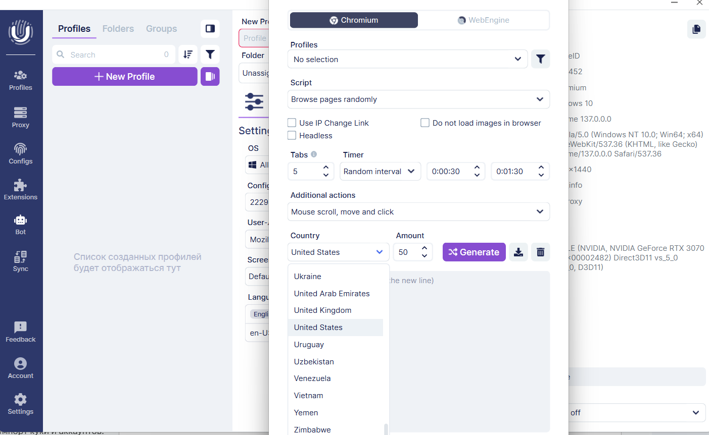
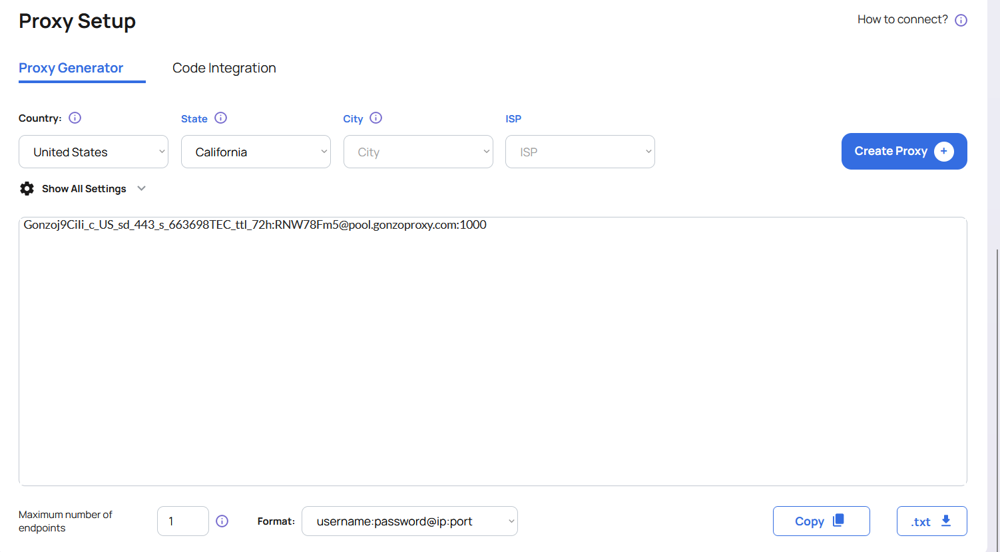
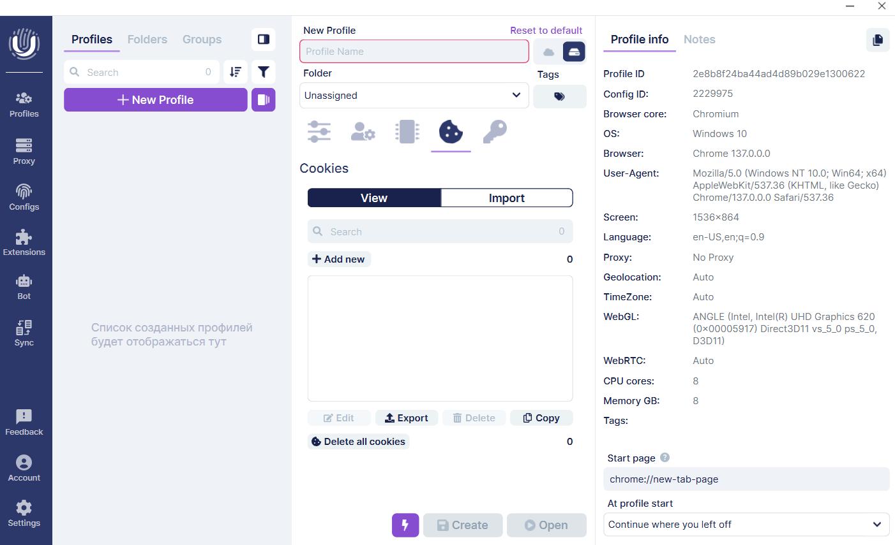
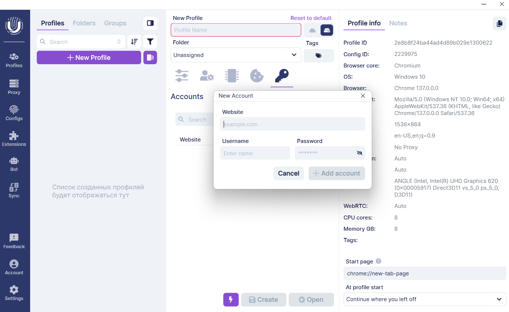

# 🔐 Настройка Undetectable

В мире многозадачности и мультиаккаунтинга одним из главных вызовов является сохранение анонимности и защита аккаунтов от блокировок. Современные сайты используют мощные антифрод-системы, которые легко выявляют подозрительные активности. Но именно тут на помощь приходят [антидетект браузер Undetectable](https://undetectable.io/ru/?utm_source=gonzoproxy\&utm_medium=affiliate) и качественные резидентские прокси от [GonzoProxy](https://gonzoproxy.com/?utm_source=gitbook\&utm_medium=ru\&utm_content=undetectable).

[Резидентские прокси от GonzoProxy](https://gonzoproxy.com/?utm_source=gitbook\&utm_medium=ru\&utm_content=undetectable) — это не просто обычные прокси-серверы. Они представляют собой IP-адреса, полученные от реальных устройств реальных пользователей, что делает их максимально естественными для антифрод-систем. Это идеальное решение, чтобы успешно вести мультиаккаунты без риска обнаружения.

***

## 🛠️ Особенности Undetectable

### 🔄 Синхронизатор

Эта функция позволяет одновременно управлять несколькими браузерными профилями. При нажатии кнопки синхронизации действия, совершаемые в главном окне, будут автоматически повторяться в других профилях. Например, набор текста, открытие вкладок и многое другое. Это значительно экономит время и усилия при работе с мультиаккаунтами.


<figure><figcaption></figcaption></figure>


***

### 📦 Массовая установка расширений<br>

В удобном менеджере браузерных расширений можно массово добавлять, удалять или отключать расширения сразу во всех профилях. Это особенно удобно для быстрого изменения конфигураций при работе с большим количеством аккаунтов.


<figure><figcaption></figcaption></figure>


***

### 🖥️ Отпечатки браузера

Undetectable делает работу пользователя максимально простой благодаря встроенным базовым конфигурациям (отпечаткам) самых популярных систем. Эти конфигурации регулярно обновляются и содержат реальные данные о браузерах и устройствах. Можно точно настроить отпечаток под конкретную задачу, избегая любых несоответствий и обходя антифрод.


<figure><figcaption></figcaption></figure>


Отпечатки маскируются внутри ядра браузера, а не через JavaScript, что значительно увеличивает надежность защиты от обнаружения.

***

### 🛒 Магазин конфигураций

Встроенный магазин конфигураций Undetectable предлагает мощный поиск по детальным параметрам: **User Agent**, **WebGL**, количество ядер процессора, оперативная память, разрешение экрана и другое. Это идеальное решение для поиска подходящей конфигурации для конкретной задачи.

Каждый тариф включает **ограниченное количество бесплатных конфигураций**, периодически обновляемых. **Дополнительные конфигурации можно купить на сайте**, и **они остаются навсегда в вашем аккаунте**. Конфигурации персональные, но вы можете **передавать их другим участникам команды через API-ключи**.


<figure><figcaption></figcaption></figure>


***

### 👥 Работа в команде


* **Роли пользователей:** создавайте и настраивайте роли с определёнными правами и доступами.
* **Группировка профилей:** разделяйте профили на группы и давайте участникам доступ только к нужным сегментам.
* **Облачная веб-панель:** управляйте ролями, группами и профилями онлайн, контролируя статусы профилей в реальном времени.


<figure><figcaption></figcaption></figure>


> Для доступа к командным настройкам перейдите в раздел **Аккаунт → Cloud Dash**, где удобно распределять роли, группы и создавать необходимые ограничения.

***

### 🍪 Cookies-бот (Прогрев профилей)

Cookies-бот автоматизирует процесс наполнения профиля куками, имитируя естественное поведение реального пользователя в интернете. Встроенный генератор популярных сайтов формирует списки ресурсов согласно выбранной географии.


<figure><figcaption></figcaption></figure>


**Инструкция по прогреву профилей:**

1. Выбираем браузер Chromium и профиль.
2. Активируем режим запуска страниц в случайном порядке.
3. Убираем галочки со следующих пунктов, если они включены:
   * Использовать ссылку для смены IP
   * Не подгружать картинки
   * Headless-режим
4. Устанавливаем случайное количество вкладок.
5. Таймер выставляем на случайный интервал (рекомендуется 30–90 секунд для естественного поведения).
6. Включаем дополнительное действие «Прокрутка, перемещение и клик мыши».
7. Выбираем страну прокси, например, резидентские прокси США от GonzoProxy.
8. Указываем количество сайтов для прогрева и запускаем.

***

### ⚙️ Создание профиля в Undetectable

**Общие настройки:**

| Параметр                     | Значение                                                                       |
| ---------------------------- | ------------------------------------------------------------------------------ |
| Название профиля, Папка, Тег | Для удобства сортировки                                                        |
| ОС                           | Windows, macOS, Android или iPhone (рекомендуем соответствие с вашей системой) |
| Браузер                      | Chrome                                                                         |
| Конфигурация                 | Аналогична вашей текущей системе                                               |
| User-Agent и Экран           | По умолчанию                                                                   |
| ЦПУ                          | 2–4 ядра                                                                       |
| Оперативная память           | От 2 до 4 ГБ                                                                   |
| Языки                        | По умолчанию                                                                   |

***

### 🌐 Прокси

Допустим вы купили резидентские прокси США от [GonzoProxy](https://gonzoproxy.com/?utm_source=gitbook\&utm_medium=ru\&utm_content=undetectable) и получили строку:

```
Gonzoj9CiIi_c_US_sd_443_s_663698TEC_ttl_72h:RNW78Fm5@pool.gonzoproxy.com:1000
```


<figure><figcaption></figcaption></figure>


**Параметры подключения:**

* **Хост:** `pool.gonzoproxy.com`
* **Порт:** `1000`
* **Логин:** `Gonzoj9CiIi_c_US_sd_443_s_663698TEC_ttl_72h`
* **Пароль:** `RNW78Fm5`
* **Поддерживаемые протоколы:** `HTTPS` и `SOCKS5`


<figure><figcaption></figcaption></figure>


***

### ⚡️ Дополнительные настройки

| **Подраздел** | **Параметр**          | **Значение** |
| ------------- | --------------------- | ------------ |
| **Локация**   | WebRTC                | авто         |
|               | Геолокация            | авто         |
|               | Часовой пояс          | авто         |
| **Эмуляция**  | Media Devices         | эмулировать  |
|               | Метаданные WebGL      | маскировка   |
|               | WebGPU                | маскировка   |
|               | Размер окна           | эмулировать  |
|               | Шрифты                | эмулировать  |
|               | Speech Synthesis      | эмулировать  |
| **Шумы**      | Canvas                | Шум          |
|               | AudioContext          | Шум          |
|               | Хеш изображения WebGL | Шум          |
|               | ClientRects           | Шум          |

***


* **Четвёртая вкладка:** импорт и экспорт файлов cookie


<figure><figcaption></figcaption></figure>


* **Пятая вкладка:** ручное добавление логинов и паролей аккаунтов или импорт/экспорт данных


<figure><figcaption></figcaption></figure>

***

### 🎯 Итоги

Антидетект-браузер [Undetectable](https://undetectable.io/ru/?utm_source=gonzoproxy\&utm_medium=affiliate) вместе с резидентскими прокси от[ GonzoProxy](https://gonzoproxy.com/?utm_source=gitbook\&utm_medium=ru\&utm_content=undetectable) — мощный инструмент, который значительно упрощает управление множеством аккаунтов, надежно защищая от блокировок и идентификации.  Используйте все возможности на полную, чтобы добиться максимальной эффективности и успеха в ваших задачах!

***

### 👾 Попробовать можно здесь: [GonzoProxy.com](https://gonzoproxy.com/?utm_source=gitbook\&utm_medium=ru\&utm_content=undetectable)

***

### 📱 Мы на связи

* [Telegram-канал ](https://t.me/GonzoProxy)
* [Telegram-чат ](https://t.me/GonzoProxy_Chat)
* [Instagram](https://www.instagram.com/gonzoproxy)
* [Поддержка 24/7 ](https://t.me/GonzoProxy_bot)

💬 Наша команда всегда на связи! Обращайтесь в любое время суток — решим любой вопрос в течение нескольких минут.
