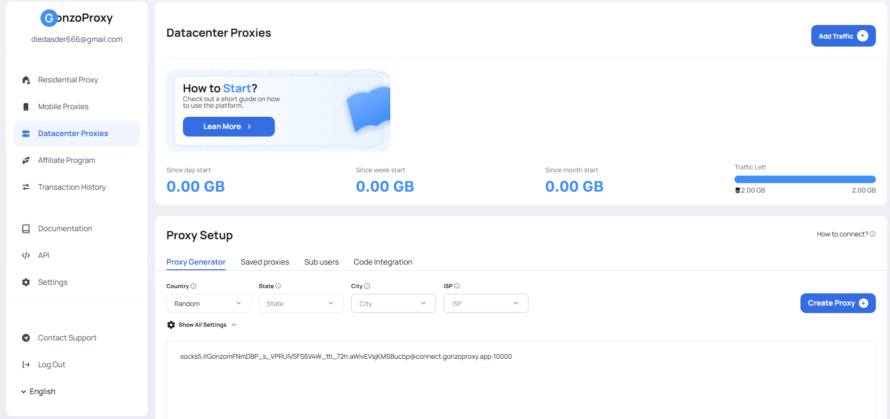

# ⚙️ Серверные (датацентровые) прокси GonzoProxy

### 🏢 Что такое серверные прокси?

<figure><figcaption></figcaption></figure>

Серверные прокси это IP-адреса, которые выделяются из дата-центров, а не от реальных пользователей. Такие адреса физически принадлежат серверной инфраструктуре, поэтому сайты в целом легче распознают их как прокси или бот-трафик.

Наш собственный замер 14 сентября 2026 года не подтверждает, что этот пул быстрее остальных: медиана времени отклика составила 1,44 с у датацентрового пула и 1,33 с у резидентского. Интервалы для этих двух чисел мы не публикуем, поэтому разницу стоит считать небольшой и не выбирать датацентровый пул ради скорости.

***

### ⚙️ Технология и особенности сети

**Принцип работы:**

* IP-адреса размещаются на серверах в дата-центрах и не привязаны к конкретному живому устройству
* Отсутствует естественная история использования, характерная для резидентских и мобильных IP
* Соединение идёт напрямую через выделенный канал сервера, без промежуточных реальных устройств

**Почему серверные прокси легче палятся:**

* У IP нет истории обычного пользователя, антифрод-системы видят диапазоны, принадлежащие дата-центрам
* Многие сервисы ведут базы известных серверных подсетей и блокируют их по умолчанию
* Подходит для задач, где не важно, что адрес принадлежит дата-центру

***

### 🌍 Параметры сети

* 112 стран в селекторе кабинета для датацентрового пула, прочитано 14 сентября 2026 года. Это количество стран, которые можно выбрать, а не количество адресов
* В генераторе кабинета задаются страна, регион, город и провайдер
* Один шлюз на все три пула: `connect.gonzoproxy.app:10000`
* На этом порту работают HTTP, HTTPS и SOCKS5

***

### ✅ Серверные прокси помогают

* Собирать данные из открытых источников в большом объёме
* Тестировать инфраструктуру и приложения из разных стран
* Решать задачи, где сервис не проверяет принадлежность адреса к дата-центру

***

### 🔁 Ротация&#x20;

Доступны два режима:

* **На каждый запрос**: новый IP выдаётся при каждом обращении
* **Sticky-сессия**: IP закрепляется на время сессии, до 7 дней, и может смениться до её окончания

Сколько sticky-адрес держится на самом деле, по нашему замеру 14 сентября 2026 года: на горизонте 84 минут тот же адрес сохранили 51 сессия из 90, то есть 56,7%, доверительный интервал Уилсона от 46,4% до 66,4%. Половина потерь пришлась на первые 35 минут. Замер шёл сразу по всем трём пулам, и пулы между собой не разошлись, поэтому для датацентрового пула цифра та же.

В sticky-режиме IP также меняется при пересоздании сессии.

***

### 🧠 Экспертные советы

**Когда лучше подойдёт другой пул:** если сервис, с которым вы работаете, внимательно смотрит на адрес, ближе будет резидентский или мобильный пул. Мы не измеряли, как конкретные сервисы относятся к нашим адресам, поэтому это рекомендация про тип адреса, а не прогноз по сервису.

**Где серверные прокси уместны:** массовый парсинг открытых источников, мониторинг цен и задачи с высокой частотой запросов к источникам, которые не проверяют принадлежность адреса к дата-центру.

**Комбинирование типов:** один аккаунт, один шлюз и одна форма логина покрывают все три пула, поэтому объёмную часть работы можно вести через датацентровый пул, а на резидентский или мобильный переключаться там, где важен тип адреса.

***

### 🛠️ Технические особенности 

* Трафик оплачивается по гигабайтам: опубликованная таблица цен и есть тот баланс, из которого он списывается
* **Поддержка** в Telegram: [@gonzoproxy\_bot](https://t.me/gonzoproxy_bot)

***

### 🚀 Начните сегодня 

Заведите аккаунт, выберите страну и подключайтесь через `connect.gonzoproxy.app:10000`.

***

### 👾 Попробовать можно здесь: [GonzoProxy.com](https://gonzoproxy.com) 

***

### 📱 Мы на связи 

* [Telegram-канал ](https://t.me/GonzoProxy)
* [Telegram-чат ](https://t.me/GonzoProxy_Chat)
* [Instagram](https://www.instagram.com/gonzoproxy)
* [Поддержка 24/7 ](https://t.me/GonzoProxy_bot)

💬 Наша команда всегда на связи! Обращайтесь в любое время суток.
